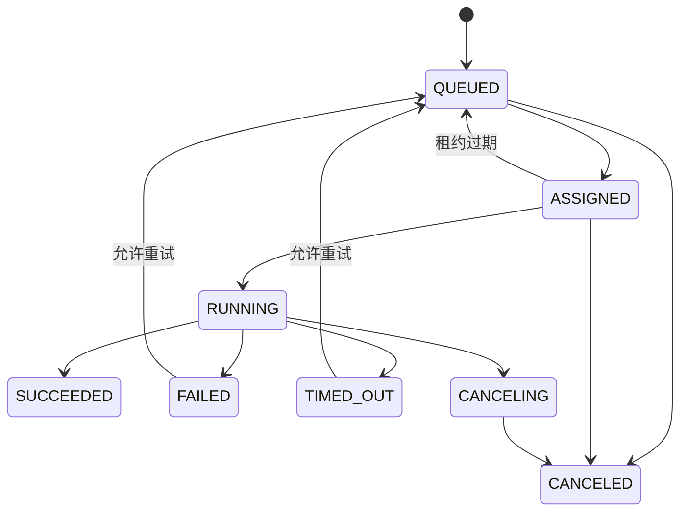

# AI 工程化与交付平台——产品需求规格说明书

| 属性 | 内容 |
|---|---|
| 文档版本 | V1.0 |
| 状态 | 第一阶段开发基线 |
| 目标版本 | Phase 1 / MVP Foundation |
| 更新日期 | 2026-08-20 |
| 关联文档 | [总体架构](02-系统总体架构与模块边界.md) · [ER 与 API](03-数据库ER模型与API契约.md) · [迭代与验收](04-第一阶段迭代任务与验收标准.md) |

## 1. 文档目的

本文档定义第一阶段可编码、可测试、可部署的产品需求基线。第一阶段只解决一条关键链路：

> 用户注册登录 → 创建企业和项目 → 上传文件到 OSS → 创建通用任务 → 本地 Agent 安全领取任务 → 实时回传日志和状态 → 上传结果 → 用户查看和下载结果。

本阶段不实现完整训练平台、标注系统、芯片适配和真实设备实验室，但所有核心对象和接口必须为后续能力预留扩展位置。

## 2. 产品定位

平台是连接客户、AI 工程师、本地算力和真实设备的混合云控制平台。云端负责用户、项目、权限、资产元数据、任务状态和审计；本地 Agent 负责数据处理、训练、编译和测试等重任务。

### 2.1 第一阶段目标

- 建立安全、完整的用户与企业体系。
- 建立项目级数据隔离和角色权限。
- 支持浏览器直传阿里云 OSS，应用服务器不转发大文件。
- 建立可靠的云端任务与本地 Agent 通信机制。
- 实现任务状态机、日志回传、取消、超时和失败重试基础能力。
- 形成可观察、可审计、可自动部署的工程骨架。

### 2.2 成功指标

| 编号 | 指标 | 第一阶段目标 |
|---|---|---:|
| KPI-01 | 新用户完成注册并创建首个项目的成功率 | ≥95% |
| KPI-02 | 1 GB 文件断点上传成功率 | ≥99%（正常网络） |
| KPI-03 | 已分配任务日志可见延迟 | P95 ≤3 秒 |
| KPI-04 | Agent 断线后自动恢复任务状态 | ≤60 秒重新上线并续报 |
| KPI-05 | 未授权跨企业资源访问阻断率 | 100% |
| KPI-06 | 关键操作审计覆盖率 | 100% |
| KPI-07 | 标准演示链路成功率 | 连续 20 次 ≥95% |

## 3. 用户与角色

| 角色 | 说明 | 第一阶段主要权限 |
|---|---|---|
| 平台管理员 | 平台运营与运维人员 | 查看企业、禁用用户、查看 Agent、审计与系统状态 |
| 企业所有者 | 创建企业的用户 | 企业设置、成员邀请、项目全权限、Agent 管理 |
| 企业管理员 | 企业授权管理员 | 成员、项目和 Agent 管理，不可转移所有权 |
| 项目管理员 | 单项目负责人 | 项目设置、成员、文件、任务与结果管理 |
| 工程师 | 算法/平台工程人员 | 上传文件、创建/取消任务、查看日志与结果 |
| 观察者 | 客户或评审人员 | 只读查看项目、任务状态和允许下载的结果 |

权限计算规则：平台角色、企业角色和项目角色取授权并集，但显式禁用、企业边界和资源所有权校验优先。

## 4. 术语与核心对象

| 术语 | 定义 |
|---|---|
| 企业 Organization | 数据、成员、项目和 Agent 的最高业务隔离边界 |
| 项目 Project | 一项 AI 交付工作的协作和资产边界 |
| 资产 Artifact | OSS 中对象的受控元数据记录，可作为任务输入或输出 |
| 任务 Job | 一次可调度、可执行、可追踪的异步工作 |
| 任务尝试 Job Attempt | 某任务的一次实际执行，重试会产生新尝试 |
| Agent | 部署在本地算力节点、主动连接云端并执行任务的程序 |
| 能力标签 Capability | Agent 可执行任务的能力声明，如 `shell.v1`、`python.v1` |
| 审计事件 Audit Event | 对安全或业务关键操作的不可变记录 |

## 5. 用户故事与功能需求

需求优先级使用 Must / Should / Could。第一阶段验收只强制 Must。

### 5.1 注册、登录和账户

| 编号 | 优先级 | 需求 |
|---|---|---|
| AUTH-001 | Must | 用户可使用邮箱和密码注册，邮箱在平台内唯一且大小写不敏感 |
| AUTH-002 | Must | 注册成功后发送邮箱验证链接；未验证用户不能创建企业或任务 |
| AUTH-003 | Must | 用户可使用邮箱和密码登录，成功后获得短期访问令牌和可撤销刷新令牌 |
| AUTH-004 | Must | 用户可退出当前会话；退出后刷新令牌立即失效 |
| AUTH-005 | Must | 用户可发起忘记密码流程，重置令牌单次有效且 30 分钟过期 |
| AUTH-006 | Must | 连续登录失败触发渐进式限流；不得透露邮箱是否存在 |
| AUTH-007 | Must | 用户可查看和修改姓名、头像、语言及时区 |
| AUTH-008 | Should | 用户可查看并撤销其他登录会话 |
| AUTH-009 | Should | 支持 TOTP MFA，企业可在后续版本强制启用 |

密码规则：长度至少 10 位，禁止常见泄露密码；密码仅保存 Argon2id 哈希。访问令牌建议 15 分钟，刷新令牌最长 7 天并实施轮换。

### 5.2 企业与成员

| 编号 | 优先级 | 需求 |
|---|---|---|
| ORG-001 | Must | 已验证用户可创建企业，创建者成为企业所有者 |
| ORG-002 | Must | 企业所有者/管理员可通过邮箱邀请成员并指定企业角色 |
| ORG-003 | Must | 邀请链接单次有效、7 天过期，可撤销和重新发送 |
| ORG-004 | Must | 受邀用户登录后可接受或拒绝邀请 |
| ORG-005 | Must | 管理员可修改成员角色、停用成员或移出企业 |
| ORG-006 | Must | 企业必须始终至少有一名所有者 |
| ORG-007 | Must | 被移出企业后，用户立即失去该企业所有资源访问权 |
| ORG-008 | Should | 企业可设置名称、Logo、默认时区和数据保留期 |

### 5.3 项目与项目成员

| 编号 | 优先级 | 需求 |
|---|---|---|
| PRJ-001 | Must | 企业所有者/管理员可创建项目，项目编号在企业内唯一 |
| PRJ-002 | Must | 项目包含名称、描述、状态、负责人和标签 |
| PRJ-003 | Must | 项目管理员可添加企业成员并指定项目角色 |
| PRJ-004 | Must | 项目成员只能访问自己被授权的项目 |
| PRJ-005 | Must | 项目可归档；归档后禁止新增文件和任务，但允许读取 |
| PRJ-006 | Must | 删除项目第一阶段采用软删除，仅平台管理员可执行最终清理 |
| PRJ-007 | Should | 支持项目配额：存储量、并发任务数、月度任务量 |

项目状态：`ACTIVE → ARCHIVED`；管理员可以从 `ARCHIVED → ACTIVE` 恢复。

### 5.4 文件与资产

| 编号 | 优先级 | 需求 |
|---|---|---|
| AST-001 | Must | 工程师可在项目中创建上传会话，平台返回 OSS 临时上传凭证或预签名地址 |
| AST-002 | Must | 支持分片上传、断点续传和取消上传，单文件第一阶段上限 20 GB |
| AST-003 | Must | 上传完成后客户端调用完成接口，服务端验证对象存在、大小和校验和 |
| AST-004 | Must | 未完成验证的 OSS 对象不得成为任务输入 |
| AST-005 | Must | 资产记录包含名称、类型、大小、SHA-256、OSS Key、创建者和状态 |
| AST-006 | Must | 下载使用短期预签名 URL，默认 10 分钟过期 |
| AST-007 | Must | OSS Key 由服务端生成，不接受客户端提交任意 Key |
| AST-008 | Must | 删除资产采用软删除并写审计；已被运行中任务引用的资产不可删除 |
| AST-009 | Must | Agent 只获得当前任务输入/输出路径的最小权限临时凭证 |
| AST-010 | Should | 后台异步病毒扫描和文件类型嗅探，未通过前状态为隔离 |

资产状态：`UPLOADING → VERIFYING → AVAILABLE`；异常进入 `FAILED` 或 `QUARANTINED`；删除进入 `DELETED`。

### 5.5 Agent 注册与管理

| 编号 | 优先级 | 需求 |
|---|---|---|
| AGT-001 | Must | 企业管理员可创建一次性 Agent 注册令牌，令牌默认 30 分钟过期 |
| AGT-002 | Must | Agent 使用注册令牌换取唯一身份和长期证书，令牌随后失效 |
| AGT-003 | Must | Agent 主动建立 mTLS 出站连接，不要求本地开放公网入站端口 |
| AGT-004 | Must | Agent 上报名称、版本、OS、架构、CPU、内存、GPU、磁盘和能力标签 |
| AGT-005 | Must | Agent 每 15 秒发送心跳；连续 60 秒未收到心跳标记为离线 |
| AGT-006 | Must | 管理员可启用、禁用和吊销 Agent 凭证 |
| AGT-007 | Must | Agent 仅能领取同企业且匹配能力标签的任务 |
| AGT-008 | Must | Agent 支持最大并发数和资源占用声明 |
| AGT-009 | Should | Agent 自动升级采用签名安装包、灰度和失败回滚 |

Agent 状态：`REGISTERING / ONLINE / BUSY / DRAINING / OFFLINE / DISABLED`。

### 5.6 任务创建与执行

| 编号 | 优先级 | 需求 |
|---|---|---|
| JOB-001 | Must | 工程师可创建任务，指定任务类型、名称、输入资产、参数、所需能力和超时 |
| JOB-002 | Must | 参数必须通过对应任务类型的 JSON Schema 校验 |
| JOB-003 | Must | 创建接口支持幂等键，重复请求不得创建多个任务 |
| JOB-004 | Must | 调度器选择同企业、在线、启用、能力匹配且有容量的 Agent |
| JOB-005 | Must | Agent 以租约方式领取任务；租约到期且无心跳时任务可重新排队 |
| JOB-006 | Must | Agent 获得当前尝试对应的输入下载和输出上传临时权限 |
| JOB-007 | Must | Agent 实时回传结构化日志、进度、指标和最终状态 |
| JOB-008 | Must | 工程师可取消排队中或运行中的任务；Agent 应在 10 秒内收到取消请求 |
| JOB-009 | Must | 任务支持最大尝试次数，重试不得覆盖前一次尝试的日志和结果 |
| JOB-010 | Must | 超时任务标记为 `TIMED_OUT`，调度器请求 Agent 终止进程并回收资源 |
| JOB-011 | Must | 只有成功尝试生成的已验证资产才能作为正式任务输出 |
| JOB-012 | Must | 页面刷新或断网重连后可继续查看完整日志和当前状态 |
| JOB-013 | Should | 管理员可设置优先级、队列并发和企业配额 |

第一阶段内置任务类型：

- `shell.echo.v1`：用于验证参数、日志、结果回传链路，不允许任意 Shell 输入。
- `artifact.copy.v1`：读取输入资产并生成摘要/复制结果，用于验证 OSS 权限。
- `python.runner.v1`：仅运行平台预置且签名的 Python 任务模板，不执行用户任意代码。

任务状态机：

### 5.7 日志、通知和结果

| 编号 | 优先级 | 需求 |
|---|---|---|
| OBS-001 | Must | 日志包含时间、级别、消息、任务、尝试、Agent 和单调递增序号 |
| OBS-002 | Must | 前端通过 SSE 或 WebSocket 查看实时日志，断线后通过序号补拉 |
| OBS-003 | Must | 单条日志上限 64 KB，敏感字段在 Agent 和服务端两侧脱敏 |
| OBS-004 | Must | 成功任务页面展示输出资产、摘要、运行时长和执行 Agent |
| OBS-005 | Must | 失败任务展示标准错误码、用户可读说明和诊断 ID |
| OBS-006 | Should | 任务成功/失败通过站内通知及邮件通知创建者 |

### 5.8 管理后台和审计

| 编号 | 优先级 | 需求 |
|---|---|---|
| ADM-001 | Must | 平台管理员可查询用户、企业、项目、Agent 和任务，但默认不读取客户文件内容 |
| ADM-002 | Must | 管理员可禁用用户或企业，禁用立即阻断新令牌和新任务 |
| ADM-003 | Must | 支持按时间、操作者、企业、动作和资源检索审计事件 |
| ADM-004 | Must | 审计覆盖登录、密码重置、成员/权限、上传/下载、任务、Agent 和管理员操作 |
| ADM-005 | Must | 审计记录业务上不可修改；默认在线保留 180 天 |
| ADM-006 | Must | 管理后台展示 API、数据库、队列、OSS 和 Agent 的健康状态 |

## 6. 页面清单

| 页面 | 路由建议 | 核心内容 |
|---|---|---|
| 注册/登录/找回密码 | `/auth/*` | 账户流程和错误反馈 |
| 企业选择 | `/organizations` | 企业列表、创建和接受邀请 |
| 项目列表 | `/o/:orgId/projects` | 搜索、创建、状态和负责人 |
| 项目概览 | `/o/:orgId/p/:projectId` | 文件、任务、成员和近期活动 |
| 文件资产 | `.../artifacts` | 上传、状态、下载和删除 |
| 任务列表 | `.../jobs` | 状态筛选、创建、取消和重试 |
| 任务详情 | `.../jobs/:jobId` | 状态、参数、日志、尝试和输出 |
| 企业成员 | `/o/:orgId/settings/members` | 邀请、角色和移除 |
| Agent 管理 | `/o/:orgId/settings/agents` | 注册令牌、状态、能力和禁用 |
| 个人设置 | `/settings/profile` | 资料、密码和会话 |
| 管理后台 | `/admin/*` | 用户、企业、系统健康和审计 |

## 7. 非功能需求

### 7.1 性能与容量

- 第一阶段设计容量：1,000 注册用户、100 企业、500 项目、50 在线 Agent。
- API 非文件操作在正常负载下 P95 ≤500 ms。
- 支持 100 个并发上传会话；文件流量不得经过应用服务。
- 支持 20 个并发运行任务和每秒 1,000 条日志持续写入。
- 列表接口必须分页，默认 20 条、最大 100 条。

### 7.2 可用性与恢复

- 控制平面月可用性目标 99.5%。
- PostgreSQL RPO ≤15 分钟、RTO ≤2 小时。
- OSS 资产依赖云端持久性策略，并启用版本和生命周期管理。
- 工作流和任务状态必须落库，应用重启不得丢失。
- Agent 临时离线不应导致已完成输出丢失。

### 7.3 安全与合规

- 全站 HTTPS，内部服务也使用 TLS 或受控私网。
- 数据查询必须包含 `organization_id` 范围校验，禁止只凭资源 UUID 授权。
- 所有用户输入、文件名和日志按不可信数据处理。
- 密钥不得写入代码、镜像、日志或前端。
- 提供账户注销和数据删除申请入口；实际删除按企业策略和审计要求执行。
- 依赖、镜像和交付物生成 SBOM 并进行漏洞扫描。

### 7.4 可维护性

- 前后端接口以 OpenAPI 3.1 为唯一契约来源。
- 数据库变更必须通过迁移工具，禁止手工修改生产 Schema。
- 核心模块单元测试覆盖率 ≥80%；整体后端覆盖率 ≥70%。
- 所有服务输出结构化日志，并携带 `trace_id`。
- 配置通过环境变量/配置中心注入，遵循十二要素应用原则。

### 7.5 兼容性

- 桌面端优先，支持最近两个版本的 Chrome、Edge 和 Safari。
- Agent 首版支持 Ubuntu 22.04/24.04 x86_64；Windows 和 ARM64 后续加入。
- 时区在数据库统一保存 UTC，界面按用户时区显示。

## 8. 业务规则

1. 所有业务资源必须属于且只能属于一个企业。
2. 项目成员必须首先是企业成员。
3. Agent 不属于单个项目，但任务调度必须校验企业和可选项目白名单。
4. 资产不可覆盖；同名文件生成新的资产记录和 OSS Key。
5. 任务参数和输入在创建后不可修改；重新执行必须产生新任务或新尝试。
6. 已完成尝试的日志、参数和结果不可修改。
7. 软删除对象默认不出现在业务查询中，但审计和历史引用继续有效。
8. 任何跨企业访问统一返回 404，避免泄露资源存在性。

## 9. 明确排除项

- 在线计费和支付。
- 完整数据标注 UI。
- 自定义训练脚本上传与任意代码执行。
- GPU 细粒度调度和 Kubernetes 集群管理。
- 芯片转换、量化和真实设备测试。
- OTA、现场设备群管理和客户验收报告。
- 创意市场、方案交易与供应链履约。

上述能力属于后续阶段，但不得破坏当前的企业、项目、资产、任务、Agent 和审计模型。

## 10. 发布门槛

第一阶段只有在以下条件全部满足后才允许上线试用：

- [ ] AUTH、ORG、PRJ、AST、AGT、JOB、OBS、ADM 中所有 Must 需求通过测试。
- [ ] 完成跨租户越权、上传绕过、令牌泄露和任务注入专项安全测试。
- [ ] 标准链路连续执行 20 次，成功率达到 KPI-07。
- [ ] 完成数据库恢复和 Agent 断线恢复演练。
- [ ] 生产环境监控、告警、备份、审计和管理员操作手册齐备。
- [ ] 无阻断级或严重级已知缺陷。

