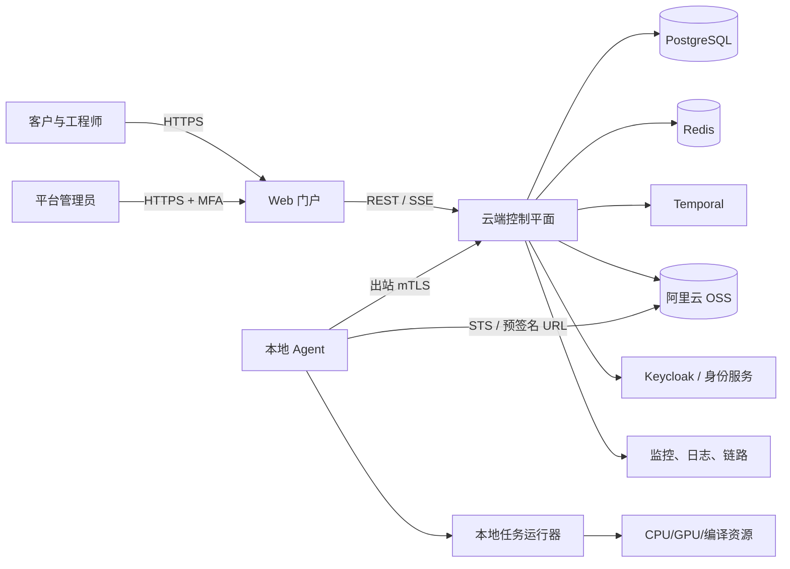
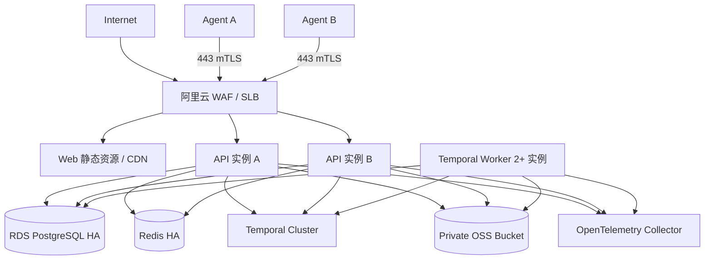
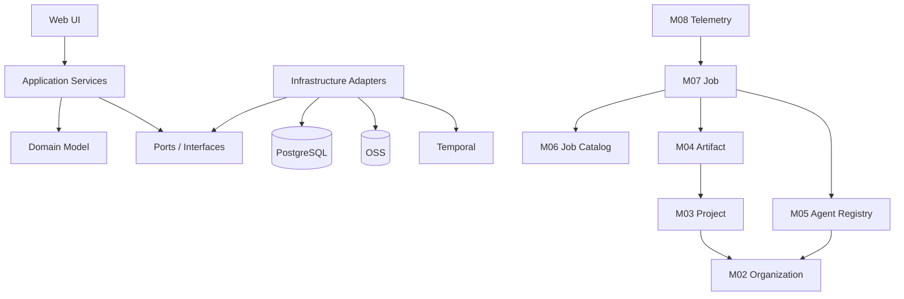
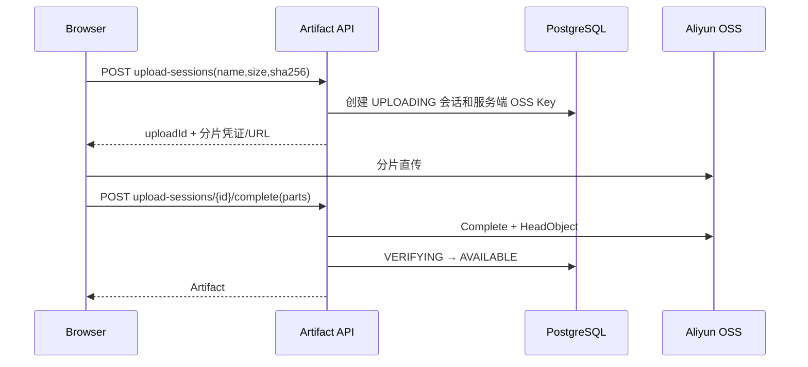
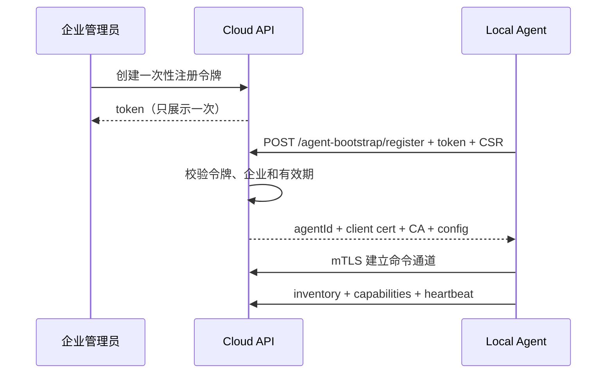
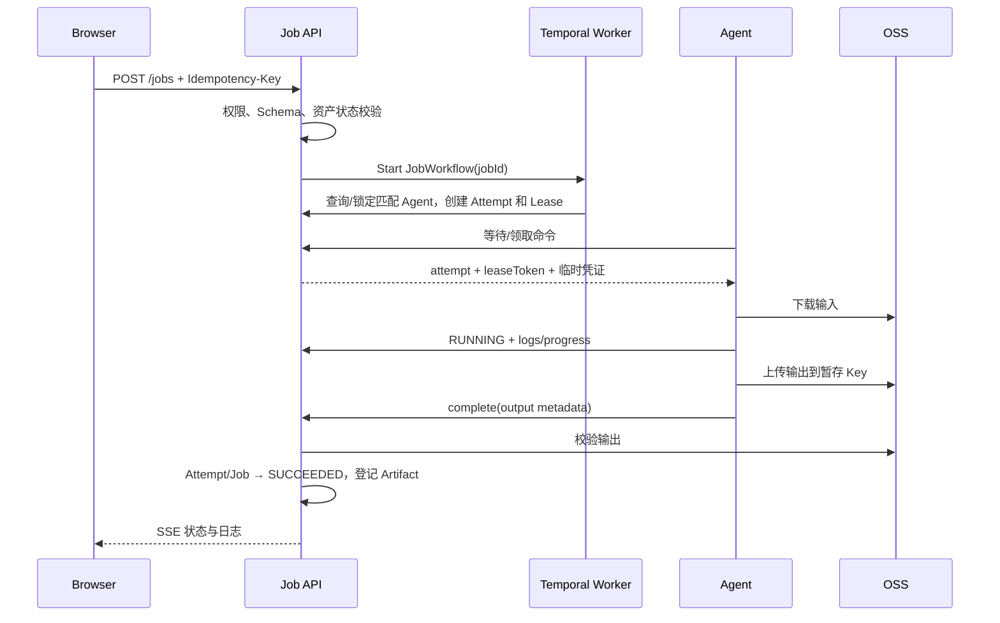

# AI 工程化与交付平台——系统总体架构与模块边界

| 属性 | 内容 |
|---|---|
| 文档版本 | V1.0 |
| 架构阶段 | 第一阶段开发基线 |
| 更新日期 | 2026-08-20 |
| 关联需求 | [产品需求规格说明书](01-产品需求规格说明书.md) |

## 1. 架构目标

第一阶段建立可演进的混合云基础：阿里云运行控制平面，阿里云 OSS 保存大工件，本地执行节点通过 Agent 主动连接云端完成任务。架构必须保证：

- 企业和项目数据严格隔离。
- 本地网络不开放公网管理端口。
- 大文件不经过 API 服务中转。
- 长任务可恢复、可取消、可重试、可审计。
- Agent 断线和服务重启不会破坏任务一致性。
- 后续能扩展训练、芯片适配、真实设备测试和 OTA，而不重写基础模型。

## 2. 架构决策摘要

| ADR | 决策 | 原因 |
|---|---|---|
| ADR-001 | 第一阶段采用模块化单体，而非业务微服务 | 团队小、业务边界仍在演进；降低部署和分布式事务成本 |
| ADR-002 | PostgreSQL 是业务事实源 | 任务、权限和审计需要事务、一致性与可查询性 |
| ADR-003 | Temporal 管理长流程，PostgreSQL 保存业务投影 | 工作流负责可靠执行，业务库负责产品查询和授权；职责分离 |
| ADR-004 | 浏览器/Agent 直传 OSS | 避免 API 服务承担大文件带宽和内存压力 |
| ADR-005 | Agent 主动出站通信并使用 mTLS | 适配 NAT/防火墙，避免暴露本地 SSH 和 API |
| ADR-006 | 任务采用租约 + 尝试模型 | 支持 Agent 失联、重试和历史证据保留 |
| ADR-007 | 实时日志使用 SSE，命令通道使用长轮询或 gRPC 流 | SSE 对浏览器简单可靠；Agent 通道与用户通道解耦 |
| ADR-008 | 不允许用户任意代码执行 | 第一阶段先建立可信执行链，降低 RCE 和多租户隔离风险 |
| ADR-009 | OpenAPI 3.1 是前后端契约源 | 可生成客户端、Mock、校验和契约测试 |

## 3. 系统上下文



### 3.1 信任边界

1. **公网用户区**：浏览器和任何用户输入均不可信。
2. **云端应用区**：API、Worker 和数据库位于阿里云私网，通过安全组隔离。
3. **对象存储区**：OSS Bucket 私有，只有服务身份和短期授权可访问。
4. **本地执行区**：Agent 所在客户/公司网络；云端不能主动进入该网络。
5. **任务沙箱区**：任务代码和输入数据视为不可信，不能接触 Agent 身份私钥。
6. **运维管理区**：生产管理入口只能经 VPN/零信任和堡垒机访问。

## 4. 部署架构

### 4.1 第一阶段生产拓扑



### 4.2 环境

| 环境 | 用途 | 数据策略 |
|---|---|---|
| Local | 单机开发 | Docker Compose，假数据，MinIO 替代 OSS |
| Test | 自动测试 | 每次流水线临时环境或共享隔离 Schema |
| Staging | 集成、验收和演练 | 与生产同构，使用脱敏/生成数据 |
| Production | 正式试用 | 独立账号、VPC、密钥、Bucket 和数据库 |

禁止将生产数据复制到开发或测试环境。

## 5. 代码仓库建议

第一阶段采用 Monorepo，便于原子修改契约：

```text
platform/
├─ apps/
│  ├─ web/                 # Vue 3 前端
│  ├─ api/                 # FastAPI 模块化单体
│  ├─ workflow-worker/     # Temporal Worker
│  └─ agent/               # Go Agent
├─ packages/
│  ├─ api-client-ts/       # OpenAPI 生成客户端
│  ├─ schemas/             # JSON Schema、事件 Schema
│  └─ ui/                  # 共享 UI 组件
├─ deploy/
│  ├─ compose/
│  ├─ helm/
│  ├─ terraform/
│  └─ ansible/
├─ docs/
│  ├─ design/
│  ├─ adr/
│  └─ runbooks/
└─ tests/
   ├─ contract/
   ├─ e2e/
   ├─ performance/
   └─ security/
```

## 6. 云端模块边界

所有模块第一阶段运行在同一个 API 进程，但必须遵守依赖规则：模块只能调用其他模块的 Application Service 或发布领域事件，不允许跨模块直接访问 Repository。

### M01 Identity Access（身份访问）

**职责**：账户、认证适配、会话、邮箱验证、密码重置和平台角色。

**拥有数据**：`users`、`user_sessions`、`email_verifications`、`password_resets`。

**对外接口**：注册、登录、刷新、退出、个人资料、会话撤销。

**不负责**：企业/项目角色；由 M02、M03 管理。

### M02 Organization（企业与成员）

**职责**：企业、企业成员、邀请、企业角色和企业状态。

**拥有数据**：`organizations`、`organization_members`、`organization_invites`。

**发布事件**：`OrganizationCreated`、`MemberAdded`、`MemberRemoved`、`OrganizationDisabled`。

**依赖**：M01 的用户只读查询；M10 的审计写入接口。

### M03 Project（项目）

**职责**：项目、项目成员、项目角色、归档和项目配额。

**拥有数据**：`projects`、`project_members`。

**约束**：项目成员必须是企业成员；任何资源访问先校验企业，再校验项目。

### M04 Artifact（文件资产）

**职责**：上传会话、资产元数据、OSS Key、校验、下载授权和删除策略。

**拥有数据**：`artifacts`、`upload_sessions`、`artifact_references`。

**依赖**：OSS Adapter；M03 项目权限；M10 审计。

**不负责**：业务数据集版本；后续 Data Engineering 模块基于 Artifact 构建。

### M05 Agent Registry（Agent 注册中心）

**职责**：注册令牌、Agent 身份、能力、资源、心跳、启停和证书吊销。

**拥有数据**：`agent_registration_tokens`、`agents`、`agent_capabilities`、`agent_heartbeats`。

**发布事件**：`AgentOnline`、`AgentOffline`、`AgentDisabled`、`AgentCapabilitiesChanged`。

**不负责**：任务调度决策；由 M07 负责。

### M06 Job Catalog（任务类型目录）

**职责**：任务类型、版本、参数 JSON Schema、输入输出规则和所需能力。

**拥有数据**：`job_types`，系统内置数据通过迁移或种子脚本管理。

**安全边界**：用户只能选择已发布任务类型，不能提交可执行命令。

### M07 Job Orchestration（任务编排）

**职责**：任务创建、状态机、调度、租约、取消、超时、重试和任务尝试。

**拥有数据**：`jobs`、`job_inputs`、`job_attempts`、`job_leases`、`job_outputs`。

**依赖**：M04 验证资产；M05 查询可用 Agent；Temporal 执行可靠流程；M08 接收日志。

**事实源规则**：

- 业务 API 以 PostgreSQL 的任务投影为查询源。
- Temporal 保存工作流执行状态，不直接提供给前端。
- 所有状态改变由 M07 的状态转换函数完成，并带乐观锁版本号。

### M08 Runtime Telemetry（运行日志与指标）

**职责**：接收、排序、批量存储和流式分发任务日志、进度和轻量指标。

**拥有数据**：`job_log_chunks`、`job_progress_events`；大日志可归档到 OSS。

**约束**：按 `(attempt_id, sequence)` 去重；日志不能驱动任务最终状态，最终状态走 M07 命令接口。

### M09 Notification（通知）

**职责**：站内消息、邮件模板、发送重试和用户偏好。

**拥有数据**：`notifications`、`notification_deliveries`。

**第一阶段**：只消费用户、邀请和任务事件，不阻塞主业务事务。

### M10 Audit & Administration（审计与管理）

**职责**：审计事件、平台管理查询、禁用控制和系统健康聚合。

**拥有数据**：`audit_events`、`admin_actions`。

**约束**：业务模块只调用 `AuditWriter`；审计写入失败时，安全关键操作应失败或进入可靠 Outbox。

### M11 Integration Adapters（基础设施适配）

不包含业务规则，只封装外部服务：

- `ObjectStoragePort`：OSS/MinIO。
- `IdentityProviderPort`：Keycloak/内置认证。
- `WorkflowPort`：Temporal。
- `EmailPort`：阿里云邮件/SMTP。
- `SecretPort`：Vault/KMS。
- `Clock`、`IdGenerator`、`EventPublisher`。

## 7. 依赖方向



领域层不得依赖 FastAPI、SQLAlchemy、OSS SDK 或 Temporal SDK。

## 8. 关键运行流程

### 8.1 浏览器上传资产



关键控制：

- OSS 回调不能单独作为完成依据，服务端必须 HeadObject 校验。
- 客户端提交的文件名仅作展示，OSS Key 由服务端构造：`org/{orgId}/project/{projectId}/{yyyy}/{uuid}`。
- SHA-256 可由客户端计算并由 Agent/后台抽样复核；若 OSS 支持服务端校验则一并使用。

### 8.2 Agent 注册



Agent 私钥应在本地生成，云端只签发证书；注册令牌仅保存哈希。

### 8.3 任务执行



### 8.4 Agent 失联

1. Agent 心跳停止，M05 在 60 秒后标记 OFFLINE。
2. M07 不立即重复执行；等待任务租约到期。
3. 若 Agent 恢复并持有有效租约，可继续续租和上报。
4. 租约到期后 Attempt 标记 `LOST`；Job 依据重试策略重新排队或失败。
5. 旧 Agent 恢复后提交过期租约结果，服务端返回 `LEASE_EXPIRED`，结果保留在暂存区等待清理，不登记为正式资产。

## 9. 一致性与并发控制

- 所有可变聚合根包含整数 `version`，更新使用乐观锁。
- 任务状态转换在数据库事务内完成，并插入 Outbox Event。
- Outbox Publisher 至少一次投递；消费者按 `event_id` 幂等。
- API 写接口接受 `Idempotency-Key`；键按用户、路由和请求摘要保存 24 小时。
- Agent 日志按序列号幂等；任务完成接口按 Attempt 幂等。
- 禁止依赖 Redis 作为唯一事实源；Redis 丢失只影响缓存和短时性能。

## 10. Agent 内部设计

```text
agent
├─ bootstrap      注册、证书和配置
├─ control        命令通道、心跳、取消
├─ inventory      硬件和能力探测
├─ scheduler      本地并发、资源锁
├─ executor       执行器接口
│  ├─ echo
│  ├─ artifact-copy
│  └─ python-template
├─ sandbox        容器/进程隔离
├─ transfer       OSS 分片下载上传、缓存、校验
├─ telemetry      日志、进度、指标和脱敏
└─ state          本地任务日志和断线缓冲
```

### 10.1 Agent 本地目录

```text
/var/lib/prexpand-agent/
├─ identity/          # 私钥和证书，0700
├─ state/             # BoltDB/SQLite 状态
├─ cache/             # 内容寻址缓存
├─ jobs/{attemptId}/
│  ├─ input/
│  ├─ work/
│  ├─ output/
│  └─ logs/
└─ quarantine/
```

任务运行器不得读取 `identity/`。任务结束后按策略清理工作目录，缓存只按内容摘要访问。

### 10.2 执行器接口

```go
type Executor interface {
    Name() string
    Validate(spec JobSpec) error
    Prepare(ctx context.Context, spec JobSpec) error
    Run(ctx context.Context, spec JobSpec, sink EventSink) (Result, error)
    Cancel(ctx context.Context) error
    Cleanup(ctx context.Context) error
}
```

后续芯片适配器和训练运行器以新 Executor 或编排子工作流加入，不修改任务核心状态机。

## 11. 安全架构

### 11.1 身份与令牌

- 浏览器使用 OIDC Authorization Code + PKCE；刷新令牌存 HttpOnly、Secure、SameSite Cookie。
- API Token 后续使用，仅保存哈希并限制 Scope。
- Agent 证书唯一绑定 `agent_id` 和 `organization_id`，服务端不能相信 Agent 请求体中的企业 ID。
- OSS STS 凭证最长 30 分钟，只允许指定对象前缀和操作。

### 11.2 授权策略

请求授权顺序：

1. 验证主体身份和状态。
2. 从路径/资源加载企业归属。
3. 验证企业成员状态。
4. 验证项目成员或企业管理员权限。
5. 验证动作级权限。
6. 写入包含主体、动作、资源和结果的审计事件。

禁止前端隐藏按钮代替服务端授权。

### 11.3 任务隔离

- MVP 任务只运行平台签名模板。
- Linux Agent 优先使用 rootless 容器；禁用 privileged、host network 和 Docker Socket 挂载。
- 容器根文件系统只读，工作目录单独挂载。
- 配置 CPU、内存、PID、磁盘和执行时间限制。
- 默认禁止出网；确需访问的任务类型使用域名白名单代理。
- Agent 身份证书、云端管理 Token 不注入任务容器。

## 12. 可观测性

所有服务采用 OpenTelemetry，统一字段：

```text
timestamp, level, service, environment, trace_id, span_id,
organization_id, project_id, user_id, job_id, attempt_id, agent_id,
event, error_code, duration_ms
```

### 12.1 核心指标

- API：请求量、P50/P95/P99、5xx、鉴权失败、数据库连接池。
- 任务：队列长度、等待时间、运行时间、成功率、重试率和超时率。
- Agent：在线数、心跳延迟、容量、任务数、版本分布。
- OSS：上传会话成功率、校验失败、临时对象数量和流量。
- Temporal：任务队列延迟、Workflow 失败和 Activity 重试。
- 安全：登录失败、限流、越权、证书吊销和异常下载量。

### 12.2 告警

| 等级 | 示例 | 响应 |
|---|---|---|
| P1 | API 全部不可用、数据库不可写、疑似跨租户泄露 | 5 分钟响应，立即停止变更 |
| P2 | 任务调度停滞、OSS 上传大面积失败、Agent 全部离线 | 15 分钟响应 |
| P3 | 单 Agent 异常、邮件延迟、个别任务失败率升高 | 工作时间处理 |

## 13. 扩展路线

### 第二阶段

- M12 Dataset：数据集、快照、标注和质量。
- M13 Experiment/Model：实验、训练、模型注册。
- 新增 Training Executor 和 MLflow Adapter。

### 第三阶段

- M14 Hardware Adapter：模型转换、量化和芯片编译。
- M15 Lab：设备、工位、预约、电源、串口和自动测试。
- M16 Acceptance：测试套件、指标阈值和报告。

### 第四阶段

- M17 Deployment/OTA：现场设备、灰度、回滚和监控。
- 计算平面达到规模后迁移 Kubernetes/KubeEdge；控制平面领域接口保持不变。

## 14. 架构约束检查清单

- [ ] 每个业务表包含 `organization_id` 或能通过不可变关系追溯企业。
- [ ] 每个写接口定义权限、幂等、审计和错误码。
- [ ] 每个异步操作定义状态机、超时、重试和补偿。
- [ ] 每个外部依赖都有 Port、超时、重试、熔断和 Mock。
- [ ] 大文件不进入 API 请求体和 PostgreSQL。
- [ ] Agent 私钥不离开本地，任务进程不能读取 Agent 身份。
- [ ] Redis、消息和实时连接丢失不会破坏事实状态。
- [ ] 新模块不得绕过 M02/M03 的租户授权规则。

