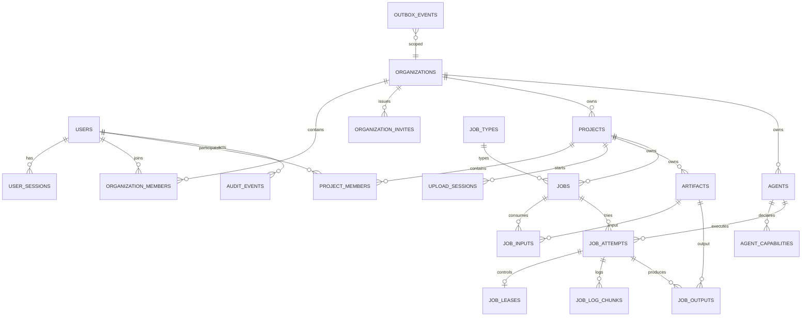

# AI 工程化与交付平台——数据库 ER 模型和 API 契约

| 属性 | 内容 |
|---|---|
| 文档版本 | V1.0 |
| 数据库 | PostgreSQL 16+ |
| API | REST + OpenAPI 3.1；Agent 通道使用 mTLS REST/长轮询，后续可切 gRPC |
| 更新日期 | 2026-08-20 |

## 1. 设计原则

- 主键统一使用 UUIDv7，按时间近似有序；API 中以字符串表示。
- 时间统一使用 `timestamptz` 并保存 UTC。
- 业务可变表包含 `created_at`、`updated_at`、`version`。
- 软删除使用 `deleted_at`；默认查询必须过滤软删除数据。
- 金额使用最小货币单位整数；本阶段暂无计费。
- 枚举在数据库使用 `varchar + check constraint`，避免 PostgreSQL Enum 难迁移。
- JSONB 只保存扩展参数、快照和 Schema，核心可查询字段必须结构化。
- 业务外键必须验证企业一致性；必要时使用复合唯一键和复合外键。
- 敏感令牌只保存 SHA-256/HMAC 哈希，永不保存明文。

## 2. ER 总览



## 3. 通用字段规范

```sql
id              uuid primary key,
created_at      timestamptz not null default now(),
updated_at      timestamptz not null default now(),
version         integer not null default 1,
deleted_at      timestamptz null
```

API 返回的资源统一包含：

```json
{
  "id": "0198...",
  "createdAt": "2026-08-20T01:00:00Z",
  "updatedAt": "2026-08-20T01:00:00Z",
  "version": 1
}
```

## 4. 表设计

### 4.1 身份

#### `users`

| 字段 | 类型 | 约束/说明 |
|---|---|---|
| id | uuid | PK |
| email | citext | UNIQUE NOT NULL |
| password_hash | text | 若完全委托 Keycloak，可为空 |
| display_name | varchar(100) | NOT NULL |
| avatar_url | text | 可空 |
| locale | varchar(16) | 默认 `zh-CN` |
| timezone | varchar(64) | 默认 `Asia/Shanghai` |
| email_verified_at | timestamptz | 可空 |
| status | varchar(20) | `PENDING/ACTIVE/DISABLED/DELETED` |
| platform_role | varchar(20) | `USER/ADMIN` |
| last_login_at | timestamptz | 可空 |

索引：`unique(lower(email))`；`(status, created_at desc)`。

#### `user_sessions`

| 字段 | 类型 | 说明 |
|---|---|---|
| id | uuid | PK |
| user_id | uuid | FK users |
| refresh_token_hash | bytea | UNIQUE |
| user_agent | text | 截断后保存 |
| ip_address | inet | 登录地址 |
| expires_at | timestamptz | 过期时间 |
| revoked_at | timestamptz | 可空 |
| replaced_by_id | uuid | 令牌轮换链，可空 |

#### `one_time_tokens`

统一保存邮箱验证、密码重置等令牌。

| 字段 | 类型 | 说明 |
|---|---|---|
| id | uuid | PK |
| user_id | uuid | FK users |
| purpose | varchar(30) | `VERIFY_EMAIL/RESET_PASSWORD` |
| token_hash | bytea | UNIQUE |
| expires_at | timestamptz | NOT NULL |
| consumed_at | timestamptz | 可空 |

### 4.2 企业与项目

#### `organizations`

| 字段 | 类型 | 说明 |
|---|---|---|
| id | uuid | PK |
| slug | varchar(64) | UNIQUE，URL 标识 |
| name | varchar(160) | NOT NULL |
| status | varchar(20) | `ACTIVE/DISABLED` |
| owner_user_id | uuid | FK users |
| settings | jsonb | 非安全关键配置 |
| storage_quota_bytes | bigint | 可空 |

#### `organization_members`

| 字段 | 类型 | 说明 |
|---|---|---|
| id | uuid | PK |
| organization_id | uuid | FK organizations |
| user_id | uuid | FK users |
| role | varchar(20) | `OWNER/ADMIN/MEMBER` |
| status | varchar(20) | `ACTIVE/SUSPENDED` |
| joined_at | timestamptz | NOT NULL |

唯一约束：`(organization_id, user_id)`。删除最后一个 OWNER 必须由应用和事务锁阻止。

#### `organization_invites`

| 字段 | 类型 | 说明 |
|---|---|---|
| id | uuid | PK |
| organization_id | uuid | FK |
| email | citext | 受邀邮箱 |
| role | varchar(20) | `ADMIN/MEMBER` |
| token_hash | bytea | UNIQUE |
| invited_by | uuid | FK users |
| expires_at | timestamptz | NOT NULL |
| accepted_at/revoked_at | timestamptz | 可空 |

#### `projects`

| 字段 | 类型 | 说明 |
|---|---|---|
| id | uuid | PK |
| organization_id | uuid | FK，租户列 |
| code | varchar(32) | 企业内唯一 |
| name | varchar(160) | NOT NULL |
| description | text | 可空 |
| status | varchar(20) | `ACTIVE/ARCHIVED` |
| owner_user_id | uuid | FK users |
| labels | jsonb | 字符串数组，后续可拆表 |
| archived_at | timestamptz | 可空 |

唯一约束：`(organization_id, code)`；索引：`(organization_id, status, updated_at desc)`。

#### `project_members`

| 字段 | 类型 | 说明 |
|---|---|---|
| id | uuid | PK |
| organization_id | uuid | 冗余租户列，用于一致授权 |
| project_id | uuid | FK projects |
| user_id | uuid | 必须是企业成员 |
| role | varchar(20) | `ADMIN/ENGINEER/VIEWER` |

唯一约束：`(project_id, user_id)`。

### 4.3 资产与上传

#### `upload_sessions`

| 字段 | 类型 | 说明 |
|---|---|---|
| id | uuid | PK |
| organization_id/project_id | uuid | 租户和项目 |
| created_by | uuid | 用户 |
| display_name | varchar(512) | 展示文件名 |
| object_key | varchar(1024) | 服务端生成、UNIQUE |
| upload_id | varchar(256) | OSS Multipart Upload ID |
| expected_size | bigint | 0 < size ≤20GB |
| expected_sha256 | char(64) | 小写十六进制 |
| content_type | varchar(255) | 声明类型 |
| status | varchar(20) | `CREATED/UPLOADING/COMPLETING/COMPLETED/ABORTED/EXPIRED/FAILED` |
| expires_at | timestamptz | 通常 24 小时 |
| completed_at | timestamptz | 可空 |

#### `artifacts`

| 字段 | 类型 | 说明 |
|---|---|---|
| id | uuid | PK |
| organization_id/project_id | uuid | 租户和项目 |
| kind | varchar(30) | `INPUT/OUTPUT/LOG/REPORT/OTHER` |
| display_name | varchar(512) | NOT NULL |
| object_key | varchar(1024) | UNIQUE NOT NULL |
| bucket | varchar(128) | NOT NULL |
| size_bytes | bigint | NOT NULL |
| sha256 | char(64) | NOT NULL |
| content_type | varchar(255) | NOT NULL |
| status | varchar(20) | `VERIFYING/AVAILABLE/QUARANTINED/FAILED/DELETED` |
| created_by | uuid | 用户；Agent 输出可空 |
| source_attempt_id | uuid | 任务输出时关联尝试，可空 |
| metadata | jsonb | 不参与核心授权 |
| retention_until | timestamptz | 可空 |

索引：`(project_id, status, created_at desc)`、`(organization_id, sha256)`。

### 4.4 Agent

#### `agent_registration_tokens`

| 字段 | 类型 | 说明 |
|---|---|---|
| id | uuid | PK |
| organization_id | uuid | FK |
| token_hash | bytea | UNIQUE |
| name_hint | varchar(100) | 可空 |
| created_by | uuid | 管理员 |
| expires_at | timestamptz | NOT NULL |
| consumed_at/revoked_at | timestamptz | 可空 |

#### `agents`

| 字段 | 类型 | 说明 |
|---|---|---|
| id | uuid | PK |
| organization_id | uuid | FK |
| name | varchar(100) | 企业内唯一 |
| status | varchar(20) | Agent 状态 |
| enabled | boolean | 默认 true |
| version_string | varchar(40) | Agent 版本 |
| os/arch | varchar(40) | 如 linux/amd64 |
| inventory | jsonb | CPU/GPU/磁盘快照 |
| max_concurrency | smallint | 1—32 |
| active_jobs | smallint | 投影值 |
| certificate_serial | varchar(128) | UNIQUE |
| certificate_expires_at | timestamptz | NOT NULL |
| last_seen_at | timestamptz | 可空 |
| last_ip | inet | 可空 |

唯一约束：`(organization_id, name)`。

#### `agent_capabilities`

| 字段 | 类型 | 说明 |
|---|---|---|
| agent_id | uuid | FK |
| capability | varchar(100) | 如 `artifact.copy.v1` |
| attributes | jsonb | 版本/扩展属性 |

主键：`(agent_id, capability)`；索引：`(capability, agent_id)`。

### 4.5 任务

#### `job_types`

| 字段 | 类型 | 说明 |
|---|---|---|
| id | uuid | PK |
| key | varchar(100) | 如 `artifact.copy` |
| version_no | integer | 版本 |
| display_name | varchar(160) | 展示名 |
| parameter_schema | jsonb | JSON Schema 2020-12 |
| input_schema/output_schema | jsonb | 输入输出约束 |
| required_capabilities | jsonb | 字符串数组 |
| default_timeout_seconds | integer | NOT NULL |
| max_timeout_seconds | integer | NOT NULL |
| enabled | boolean | NOT NULL |

唯一约束：`(key, version_no)`。

#### `jobs`

| 字段 | 类型 | 说明 |
|---|---|---|
| id | uuid | PK |
| organization_id/project_id | uuid | 租户和项目 |
| job_type_id | uuid | FK |
| name | varchar(160) | NOT NULL |
| status | varchar(20) | 任务状态 |
| parameters | jsonb | 已通过 Schema 校验的不可变快照 |
| required_capabilities | jsonb | 创建时不可变快照 |
| timeout_seconds | integer | NOT NULL |
| max_attempts | smallint | 1—5 |
| attempt_count | smallint | 默认 0 |
| priority | smallint | 默认 50，0—100 |
| created_by | uuid | FK users |
| idempotency_key | varchar(128) | 可空 |
| queued_at/started_at/finished_at | timestamptz | 可空 |
| cancel_requested_at | timestamptz | 可空 |
| error_code/error_message | varchar/text | 可空、已脱敏 |

唯一约束：`(created_by, idempotency_key)` where key not null；索引：`(organization_id, status, priority desc, queued_at)`。

#### `job_inputs`

| 字段 | 类型 | 说明 |
|---|---|---|
| job_id | uuid | FK |
| name | varchar(100) | 输入槽名称 |
| artifact_id | uuid | FK，必须 AVAILABLE 且同项目 |

主键：`(job_id, name, artifact_id)`。

#### `job_attempts`

| 字段 | 类型 | 说明 |
|---|---|---|
| id | uuid | PK |
| organization_id/project_id/job_id | uuid | FK/租户 |
| attempt_no | smallint | 从 1 开始 |
| agent_id | uuid | FK agents |
| status | varchar(20) | `ASSIGNED/RUNNING/SUCCEEDED/FAILED/TIMED_OUT/CANCELED/LOST` |
| assigned_at/started_at/finished_at | timestamptz | 可空 |
| exit_code | integer | 可空 |
| error_code/error_message | varchar/text | 可空 |
| runtime_snapshot | jsonb | Agent/OS/执行器版本快照 |

唯一约束：`(job_id, attempt_no)`。

#### `job_leases`

| 字段 | 类型 | 说明 |
|---|---|---|
| attempt_id | uuid | PK/FK |
| lease_token_hash | bytea | UNIQUE |
| issued_at | timestamptz | NOT NULL |
| expires_at | timestamptz | NOT NULL |
| renewed_at | timestamptz | NOT NULL |
| revoked_at | timestamptz | 可空 |

#### `job_outputs`

| 字段 | 类型 | 说明 |
|---|---|---|
| attempt_id | uuid | FK |
| name | varchar(100) | 输出槽 |
| artifact_id | uuid | FK |

主键：`(attempt_id, name, artifact_id)`。

#### `job_log_chunks`

| 字段 | 类型 | 说明 |
|---|---|---|
| id | bigint generated | PK |
| attempt_id | uuid | FK |
| sequence_start/end | bigint | 序号范围 |
| payload | jsonb | 日志条目数组，压缩前限制大小 |
| created_at | timestamptz | NOT NULL |

唯一约束：`(attempt_id, sequence_start)`。超过在线保留期后写 Parquet/JSONL 到 OSS，表中保存归档指针。

### 4.6 审计、幂等与事件

#### `audit_events`

| 字段 | 类型 | 说明 |
|---|---|---|
| id | uuid | PK |
| occurred_at | timestamptz | NOT NULL，不可更新 |
| organization_id/project_id | uuid | 可空 |
| actor_type | varchar(20) | `USER/AGENT/SYSTEM` |
| actor_id | uuid | 主体 ID |
| action | varchar(100) | 如 `job.create` |
| resource_type/resource_id | varchar/uuid | 目标资源 |
| result | varchar(20) | `SUCCESS/DENIED/FAILED` |
| ip_address | inet | 可空 |
| user_agent | text | 可空 |
| trace_id | varchar(64) | 可空 |
| detail | jsonb | 已脱敏，不保存 Token/密码 |

按月分区；应用数据库账户无 UPDATE/DELETE 权限。

#### `idempotency_records`

| 字段 | 类型 | 说明 |
|---|---|---|
| actor_id | uuid | 主体 |
| route_key | varchar(160) | 路由 |
| idempotency_key | varchar(128) | 客户端键 |
| request_hash | char(64) | 防止同键不同请求 |
| response_status | integer | HTTP 状态 |
| response_body | jsonb | 成功响应快照 |
| expires_at | timestamptz | 通常 24 小时 |

主键：`(actor_id, route_key, idempotency_key)`。

#### `outbox_events`

| 字段 | 类型 | 说明 |
|---|---|---|
| id | uuid | PK/event_id |
| organization_id | uuid | 可空 |
| aggregate_type/id | varchar/uuid | 聚合 |
| event_type | varchar(100) | 事件类型 |
| payload | jsonb | 版本化事件 |
| occurred_at | timestamptz | NOT NULL |
| published_at | timestamptz | 可空 |
| attempts | integer | 默认 0 |

## 5. 行级安全建议

应用层授权是主机制，同时在 PostgreSQL 开启 RLS 作为纵深防御：

```sql
ALTER TABLE projects ENABLE ROW LEVEL SECURITY;
CREATE POLICY tenant_isolation ON projects
USING (organization_id = current_setting('app.organization_id')::uuid);
```

每个事务开始时设置 `SET LOCAL app.organization_id = ...`。平台管理员使用独立数据库角色和显式审计接口，不让普通应用连接绕过 RLS。

## 6. API 通用契约

### 6.1 基础规范

- Base URL：`/api/v1`；Agent Bootstrap：`/agent-bootstrap/v1`；Agent API：`/agent-api/v1`。
- JSON 字段使用 `camelCase`；数据库字段使用 `snake_case`。
- 日期使用 RFC 3339 UTC；UUID 使用规范字符串。
- `Content-Type: application/json`；上传文件除外。
- 写接口支持 `Idempotency-Key`；资源更新要求 `If-Match: "<version>"`。
- 列表使用游标分页：`?limit=20&cursor=...`。
- 排序参数白名单，禁止客户端提交任意数据库字段。

### 6.2 成功响应

单资源直接返回资源；创建返回 `201`。删除成功返回 `204`。列表统一：

```json
{
  "items": [],
  "nextCursor": "opaque-or-null"
}
```

### 6.3 错误响应

采用 RFC 9457 Problem Details：

```json
{
  "type": "https://docs.prexpand.com/problems/validation-error",
  "title": "请求参数不合法",
  "status": 422,
  "code": "VALIDATION_ERROR",
  "detail": "请检查标记字段",
  "instance": "/api/v1/jobs",
  "traceId": "01J...",
  "errors": [{"path": "parameters.message", "reason": "required"}]
}
```

标准错误码：

| HTTP | code | 场景 |
|---:|---|---|
| 400 | INVALID_REQUEST | 语义错误 |
| 401 | UNAUTHENTICATED / TOKEN_EXPIRED | 未登录 |
| 403 | FORBIDDEN | 已知资源但动作无权限；跨企业建议返回 404 |
| 404 | RESOURCE_NOT_FOUND | 不存在或不可见 |
| 409 | RESOURCE_CONFLICT / INVALID_STATE / IDEMPOTENCY_CONFLICT | 状态或幂等冲突 |
| 412 | VERSION_MISMATCH | If-Match 失败 |
| 413 | FILE_TOO_LARGE | 文件超限 |
| 422 | VALIDATION_ERROR | Schema 校验失败 |
| 429 | RATE_LIMITED / QUOTA_EXCEEDED | 限流/配额 |
| 503 | DEPENDENCY_UNAVAILABLE / NO_AGENT_CAPACITY | 依赖不可用 |

## 7. 用户 API

| 方法 | 路径 | 权限 | 说明 |
|---|---|---|---|
| POST | `/auth/register` | Public | 注册；限流 |
| POST | `/auth/verify-email` | Public | 消费验证 Token |
| POST | `/auth/login` | Public | 登录；设置 Refresh Cookie |
| POST | `/auth/refresh` | Session | 刷新并轮换令牌 |
| POST | `/auth/logout` | User | 撤销当前会话 |
| POST | `/auth/forgot-password` | Public | 始终返回 202 |
| POST | `/auth/reset-password` | Public | 重置密码并撤销全部会话 |
| GET/PATCH | `/me` | User | 个人资料 |
| GET | `/me/sessions` | User | 会话列表 |
| DELETE | `/me/sessions/{id}` | User | 撤销会话 |

## 8. 企业与项目 API

| 方法 | 路径 | 权限 | 需求 |
|---|---|---|---|
| POST/GET | `/organizations` | Verified User | ORG-001 |
| GET/PATCH | `/organizations/{orgId}` | Org Member/Admin | ORG-008 |
| GET | `/organizations/{orgId}/members` | Org Member | ORG-005 |
| PATCH/DELETE | `/organizations/{orgId}/members/{userId}` | Org Admin | ORG-005/006 |
| POST/GET | `/organizations/{orgId}/invites` | Org Admin | ORG-002/003 |
| DELETE | `/organizations/{orgId}/invites/{id}` | Org Admin | ORG-003 |
| POST | `/invites/{token}/accept` | User | ORG-004 |
| POST/GET | `/organizations/{orgId}/projects` | Org Admin/Member | PRJ-001 |
| GET/PATCH/DELETE | `/projects/{projectId}` | Project Member/Admin | PRJ-002/005/006 |
| GET/POST | `/projects/{projectId}/members` | Project Member/Admin | PRJ-003 |
| PATCH/DELETE | `/projects/{projectId}/members/{userId}` | Project Admin | PRJ-003 |

创建项目请求：

```json
{
  "code": "CV-CAMERA-001",
  "name": "智能摄像头算法验证",
  "description": "第一阶段测试项目",
  "ownerUserId": "0198...",
  "labels": ["vision", "rk3588"]
}
```

## 9. 资产 API

| 方法 | 路径 | 权限 | 说明 |
|---|---|---|---|
| POST | `/projects/{projectId}/upload-sessions` | Engineer | 创建上传会话 |
| POST | `/upload-sessions/{id}/parts:sign` | Creator | 获取一批分片 URL |
| POST | `/upload-sessions/{id}:complete` | Creator | 完成并校验 |
| POST | `/upload-sessions/{id}:abort` | Creator/Admin | 取消上传 |
| GET | `/upload-sessions/{id}` | Project Member | 查询状态 |
| GET | `/projects/{projectId}/artifacts` | Project Member | 资产列表 |
| GET | `/artifacts/{artifactId}` | Project Member | 资产详情 |
| POST | `/artifacts/{artifactId}:download-url` | Authorized | 获取 10 分钟 URL |
| DELETE | `/artifacts/{artifactId}` | Engineer/Admin | 软删除 |

创建上传会话：

```json
{
  "displayName": "dataset.zip",
  "sizeBytes": 1073741824,
  "sha256": "9f86d081...",
  "contentType": "application/zip"
}
```

响应只返回当前对象的授权：

```json
{
  "id": "0198...",
  "objectKey": "org/.../project/.../0198...",
  "uploadId": "OSS_UPLOAD_ID",
  "partSizeBytes": 16777216,
  "expiresAt": "2026-08-21T01:00:00Z"
}
```

## 10. Agent 管理 API

### 10.1 用户侧

| 方法 | 路径 | 权限 | 说明 |
|---|---|---|---|
| POST | `/organizations/{orgId}/agent-registration-tokens` | Org Admin | 创建一次性 Token |
| GET | `/organizations/{orgId}/agents` | Org Member | Agent 列表 |
| GET/PATCH | `/agents/{agentId}` | Org Member/Admin | 详情、名称、并发数 |
| POST | `/agents/{agentId}:disable` | Org Admin | 禁用并吊销新任务 |
| POST | `/agents/{agentId}:enable` | Org Admin | 重新启用 |
| POST | `/agents/{agentId}:drain` | Org Admin | 不接新任务，等待现有任务结束 |
| DELETE | `/agents/{agentId}` | Org Owner | 吊销证书和软删除 |

注册令牌响应中的 `token` 只出现一次。

### 10.2 Agent Bootstrap/运行侧

| 方法 | 路径 | 认证 | 说明 |
|---|---|---|---|
| POST | `/agent-bootstrap/v1/register` | 一次性 Token | CSR 换证书和 Agent ID |
| POST | `/agent-api/v1/heartbeat` | mTLS | 心跳、资源和能力 |
| POST | `/agent-api/v1/commands:poll` | mTLS | 长轮询命令，超时 30 秒 |
| POST | `/agent-api/v1/attempts/{id}:accept` | mTLS + Lease | 接受任务 |
| POST | `/agent-api/v1/attempts/{id}:renew` | mTLS + Lease | 续租并回传进度 |
| POST | `/agent-api/v1/attempts/{id}/logs` | mTLS + Lease | 批量日志 |
| POST | `/agent-api/v1/attempts/{id}:complete` | mTLS + Lease | 完成任务 |
| POST | `/agent-api/v1/attempts/{id}:fail` | mTLS + Lease | 失败任务 |
| POST | `/agent-api/v1/attempts/{id}:cancel-ack` | mTLS + Lease | 确认取消 |

心跳请求：

```json
{
  "agentVersion": "0.1.0",
  "status": "ONLINE",
  "maxConcurrency": 2,
  "activeAttempts": ["0198..."],
  "inventory": {
    "os": "ubuntu-22.04",
    "arch": "amd64",
    "cpuCores": 32,
    "memoryBytes": 137438953472,
    "gpus": [{"vendor": "nvidia", "model": "L40S", "memoryBytes": 51539607552}]
  },
  "capabilities": ["shell.echo.v1", "artifact.copy.v1"]
}
```

## 11. 任务 API

| 方法 | 路径 | 权限 | 说明 |
|---|---|---|---|
| GET | `/job-types` | User | 可用任务类型和 Schema |
| POST | `/projects/{projectId}/jobs` | Engineer | 创建任务，必须带幂等键 |
| GET | `/projects/{projectId}/jobs` | Project Member | 列表与筛选 |
| GET | `/jobs/{jobId}` | Project Member | 详情和当前尝试 |
| POST | `/jobs/{jobId}:cancel` | Engineer/Admin | 请求取消 |
| POST | `/jobs/{jobId}:retry` | Engineer/Admin | 从终态创建新尝试/重新排队 |
| GET | `/jobs/{jobId}/attempts` | Project Member | 历史尝试 |
| GET | `/jobs/{jobId}/logs` | Project Member | 历史日志分页 |
| GET | `/jobs/{jobId}/events` | Project Member | SSE 状态和实时日志 |

创建任务：

```http
POST /api/v1/projects/0198.../jobs
Idempotency-Key: 5c0c6d3e-f6c0-4ef8-a676-5299c8e6a111
```

```json
{
  "name": "验证 OSS 输入输出",
  "jobType": {"key": "artifact.copy", "version": 1},
  "inputs": [{"name": "source", "artifactId": "0198..."}],
  "parameters": {"outputName": "copy.bin"},
  "timeoutSeconds": 1800,
  "maxAttempts": 2
}
```

任务详情：

```json
{
  "id": "0198...",
  "projectId": "0198...",
  "name": "验证 OSS 输入输出",
  "jobType": {"key": "artifact.copy", "version": 1},
  "status": "RUNNING",
  "parameters": {"outputName": "copy.bin"},
  "requiredCapabilities": ["artifact.copy.v1"],
  "attemptCount": 1,
  "currentAttempt": {
    "id": "0198...",
    "attemptNo": 1,
    "agent": {"id": "0198...", "name": "local-gpu-01"},
    "status": "RUNNING",
    "progress": {"percent": 42, "message": "正在上传结果"}
  },
  "outputs": [],
  "version": 4
}
```

### 11.1 SSE 格式

```text
id: 1042
event: log
data: {"attemptId":"...","sequence":1042,"timestamp":"...","level":"INFO","message":"..."}

id: state-8
event: state
data: {"jobId":"...","status":"SUCCEEDED","version":8}
```

客户端重连发送 `Last-Event-ID`；服务端先补历史再进入实时流。每 15 秒发送 comment heartbeat。

## 12. 管理与审计 API

| 方法 | 路径 | 权限 | 说明 |
|---|---|---|---|
| GET | `/admin/users` | Platform Admin | 用户查询 |
| POST | `/admin/users/{id}:disable` | Platform Admin | 禁用用户 |
| GET | `/admin/organizations` | Platform Admin | 企业查询 |
| POST | `/admin/organizations/{id}:disable` | Platform Admin | 禁用企业 |
| GET | `/admin/health` | Platform Admin | 聚合健康状态 |
| GET | `/audit-events` | Org Admin/Platform Admin | 范围化审计查询 |

管理员访问客户元数据也必须写 `admin.resource.read` 审计事件；文件内容无默认访问接口。

## 13. 领域事件契约

统一事件 Envelope：

```json
{
  "eventId": "0198...",
  "eventType": "JobSucceeded.v1",
  "occurredAt": "2026-08-20T01:00:00Z",
  "organizationId": "0198...",
  "aggregate": {"type": "job", "id": "0198...", "version": 8},
  "traceId": "01J...",
  "payload": {}
}
```

第一阶段事件：

- `UserRegistered.v1`、`EmailVerified.v1`。
- `OrganizationCreated.v1`、`OrganizationMemberRemoved.v1`。
- `ProjectCreated.v1`、`ProjectArchived.v1`。
- `ArtifactAvailable.v1`、`ArtifactDeleted.v1`。
- `AgentOnline.v1`、`AgentOffline.v1`、`AgentDisabled.v1`。
- `JobCreated.v1`、`JobAssigned.v1`、`JobStarted.v1`、`JobSucceeded.v1`、`JobFailed.v1`、`JobCanceled.v1`。

事件只能新增字段；破坏性修改发布新版本。

## 14. 数据迁移和种子数据

- 使用 Alembic 管理 PostgreSQL 迁移；每次发布必须在 Staging 从生产结构副本演练。
- 迁移遵循 Expand → Migrate → Contract，避免发布期间同时改写字段语义。
- `job_types` 通过版本化种子脚本插入，已被任务引用的类型版本不得更新参数 Schema。
- 本地开发生成固定测试企业、用户、项目和 Agent，但禁止在生产运行开发种子脚本。

## 15. 契约测试要求

- OpenAPI 文档通过 Spectral 规则校验。
- 前端 TypeScript 客户端从 OpenAPI 自动生成，禁止手写重复 DTO。
- 每个接口至少包含成功、未认证、未授权、资源不存在、校验失败和状态冲突测试。
- Agent 与云端使用独立的兼容性测试套件；至少支持当前和前一个 Agent 次版本。
- 数据库集成测试必须使用真实 PostgreSQL，不以 SQLite 替代。

