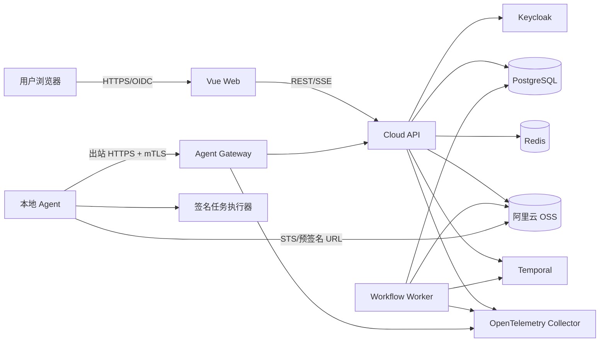
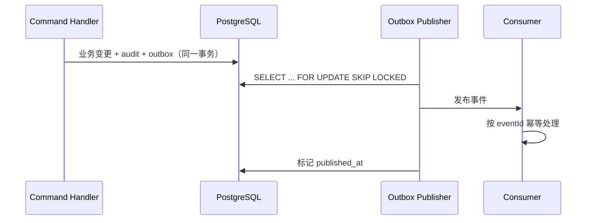
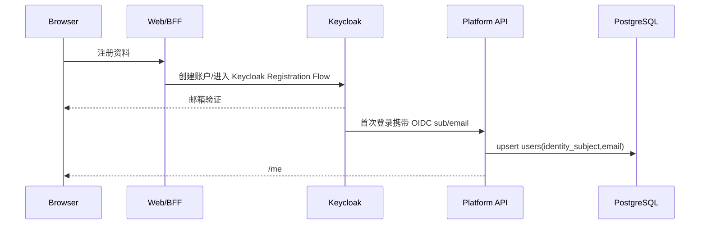
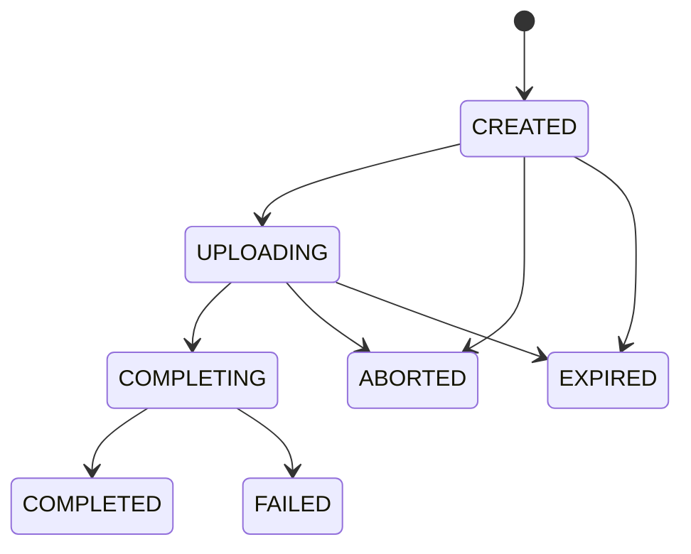
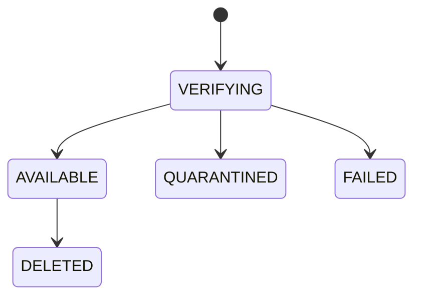
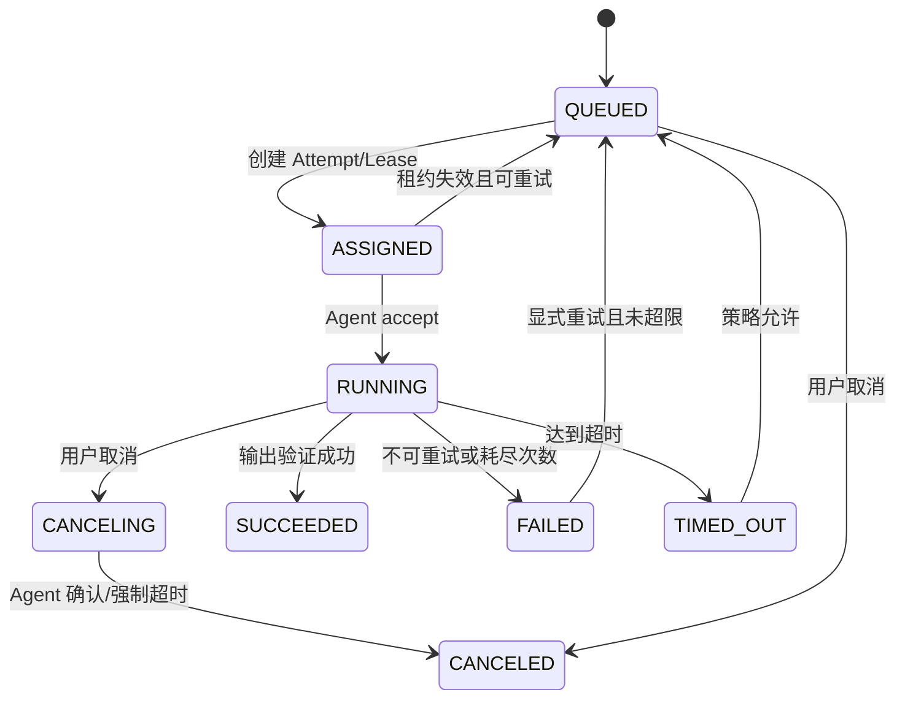

# 多模型、多芯片 AI 工程化与交付平台——详细设计

| 属性 | 内容 |
|---|---|
| 文档版本 | V1.0 |
| 设计基线 | Phase 1 / MVP Foundation |
| 更新日期 | 2026-08-20 |
| 面向读者 | 产品、架构、前端、后端、Agent、测试、DevOps、安全与运维人员 |
| 上游文档 | [项目详细介绍](项目详细介绍.md) · [平台概要](平台概要.md) · [产品需求规格](design/01-产品需求规格说明书.md) · [总体架构](design/02-系统总体架构与模块边界.md) · [ER 与 API](design/03-数据库ER模型与API契约.md) · [迭代与验收](design/04-第一阶段迭代任务与验收标准.md) |

## 1. 文档目的

本文将项目已有需求、架构、数据库、API 和迭代设计收敛为一份可直接指导编码的详细设计。本文重点回答：

- 代码仓库如何组织；
- 每个模块有哪些类、接口、命令、查询和数据表；
- 关键状态机和事务边界如何实现；
- 浏览器、云端、OSS、Temporal 与本地 Agent 如何交互；
- 如何实现企业隔离、幂等、租约、重试、日志补传和审计；
- 如何部署、测试、监控、恢复并为后续训练、芯片适配和实机验收扩展。

第一阶段仅交付以下闭环：

```text
注册登录 → 企业与项目 → OSS 资产 → 通用任务
→ 本地 Agent 执行 → 日志/进度 → 输出资产 → 审计与运维
```

完整数据标注、模型训练管理、异构芯片编译、真实硬件实验室、验收报告、OTA 和生态交易不在第一阶段实现，但扩展点在本文中明确定义。

## 2. 统一设计裁决

现有文档中部分实现保留了多种选择。为了能够直接编码，本文作出以下最终裁决。

| 编号 | 裁决 | 说明 |
|---|---|---|
| DD-001 | 身份认证使用 Keycloak | Keycloak 保存密码、MFA、会话和身份协议；业务数据库只保存用户投影和业务状态 |
| DD-002 | Web 使用 OIDC Authorization Code + PKCE | 不在前端保存刷新令牌；刷新令牌放 Secure、HttpOnly Cookie 或采用 BFF 会话 |
| DD-003 | 后端采用 FastAPI 模块化单体 | 领域模块隔离但同进程部署；避免 MVP 微服务复杂度 |
| DD-004 | PostgreSQL 是业务事实源 | Redis、SSE 和 Temporal 均不得成为唯一业务状态源 |
| DD-005 | Temporal 负责长流程可靠执行 | 业务表保存可查询投影；工作流不能被前端直接访问 |
| DD-006 | Agent 使用独立 `agent-api` 网关 | 独立域名/入口完成 mTLS，普通浏览器 API 不处理客户端证书 |
| DD-007 | Agent 首版使用 HTTPS 长轮询 | 更容易穿过企业网络；协议保持可迁移到 gRPC 双向流 |
| DD-008 | 文件使用 OSS Multipart 直传 | API 只签名和校验，不中转文件字节 |
| DD-009 | 任务采用 Job、Attempt、Lease 三层模型 | Job 表示用户意图；Attempt 表示一次执行；Lease 防止重复执行和过期提交 |
| DD-010 | 首版只运行平台签名执行器 | 不接受用户任意 Shell、Python 或容器镜像，防止远程代码执行 |
| DD-011 | 日志采用批量持久化 + SSE | Agent 批量上报，PostgreSQL 保存近期索引，长期归档 OSS |
| DD-012 | 事务事件采用 Transactional Outbox | 保证数据库状态与异步事件最终一致 |
| DD-013 | 前端采用 Vue 3 + TypeScript | UI 使用 Ant Design Vue，接口客户端由 OpenAPI 自动生成 |
| DD-014 | Agent 使用 Go | 单文件部署、资源占用低、并发与系统调用能力适合本地节点 |

## 3. 第一阶段系统边界

### 3.1 系统上下文



### 3.2 域名与入口

| 域名示例 | 入口 | 客户端 | 认证 |
|---|---|---|---|
| `app.example.com` | CDN/静态站点 | 浏览器 | OIDC |
| `api.example.com` | WAF + ALB | 浏览器/Web | Bearer/BFF Session |
| `agent.example.com` | NLB/Envoy/Nginx | 本地 Agent | 双向 TLS + Lease Token |
| `auth.example.com` | Keycloak | 浏览器/API | OIDC/OAuth2 |

Agent 入口必须能读取并验证真实客户端证书；若云 WAF/ALB 不支持可靠透传客户端证书，使用独立 NLB + Envoy/Nginx 完成 mTLS，禁止通过请求头模拟证书身份。

## 4. 技术栈与版本基线

| 层 | 技术 |
|---|---|
| Web | Vue 3、TypeScript、Vite、Vue Router、Pinia、Ant Design Vue、TanStack Query for Vue、ECharts |
| API | Python 3.12、FastAPI、Pydantic v2、SQLAlchemy 2、Alembic、httpx |
| Workflow | Temporal Server、Temporal Python SDK |
| Agent | Go 1.24+、标准库 HTTP/TLS、容器执行适配层 |
| 数据库 | PostgreSQL 16+，生产使用 RDS PostgreSQL 高可用 |
| 缓存/短时协调 | Redis 7+；不得保存唯一事实状态 |
| 对象存储 | 阿里云 OSS；本地开发使用 MinIO |
| 身份 | Keycloak，生产接 KMS/Vault 管理 Client Secret 和 CA |
| 可观测 | OpenTelemetry、Prometheus、Grafana、Loki、Tempo、Sentry |
| 镜像与安全 | Harbor/ACR、Trivy、Syft/Grype、Cosign |
| CI/CD | GitLab CI 或 GitHub Actions；Argo CD/部署脚本 |
| 测试 | pytest、Testcontainers、Vitest、Playwright、Go test、k6 |

正式实现前锁定依赖版本并生成锁文件；不得在生产镜像中使用浮动 `latest` 标签。

## 5. 代码仓库详细结构

```text
platform/
├─ apps/
│  ├─ web/
│  │  ├─ src/
│  │  │  ├─ app/                   # 应用装配、路由、全局 Provider
│  │  │  ├─ modules/
│  │  │  │  ├─ auth/
│  │  │  │  ├─ organizations/
│  │  │  │  ├─ projects/
│  │  │  │  ├─ artifacts/
│  │  │  │  ├─ agents/
│  │  │  │  ├─ jobs/
│  │  │  │  ├─ audit/
│  │  │  │  └─ admin/
│  │  │  ├─ components/            # 无业务含义的共享组件
│  │  │  ├─ composables/
│  │  │  ├─ generated/             # OpenAPI 自动生成，不手改
│  │  │  └─ styles/
│  │  └─ tests/
│  ├─ api/
│  │  ├─ src/platform_api/
│  │  │  ├─ main.py
│  │  │  ├─ settings.py
│  │  │  ├─ common/
│  │  │  │  ├─ auth.py
│  │  │  │  ├─ errors.py
│  │  │  │  ├─ idempotency.py
│  │  │  │  ├─ pagination.py
│  │  │  │  ├─ tenancy.py
│  │  │  │  └─ observability.py
│  │  │  ├─ modules/
│  │  │  │  ├─ identity/
│  │  │  │  ├─ organization/
│  │  │  │  ├─ project/
│  │  │  │  ├─ artifact/
│  │  │  │  ├─ agent_registry/
│  │  │  │  ├─ job_catalog/
│  │  │  │  ├─ job/
│  │  │  │  ├─ telemetry/
│  │  │  │  ├─ notification/
│  │  │  │  └─ audit/
│  │  │  └─ infrastructure/
│  │  │     ├─ database/
│  │  │     ├─ keycloak/
│  │  │     ├─ oss/
│  │  │     ├─ temporal/
│  │  │     ├─ email/
│  │  │     └─ secrets/
│  │  └─ tests/
│  ├─ workflow-worker/
│  │  ├─ src/platform_worker/
│  │  │  ├─ workflows/job_workflow.py
│  │  │  ├─ activities/job_activities.py
│  │  │  ├─ activities/artifact_activities.py
│  │  │  └─ worker.py
│  │  └─ tests/
│  └─ agent/
│     ├─ cmd/prexpand-agent/main.go
│     ├─ internal/bootstrap/
│     ├─ internal/control/
│     ├─ internal/inventory/
│     ├─ internal/scheduler/
│     ├─ internal/executor/
│     ├─ internal/sandbox/
│     ├─ internal/transfer/
│     ├─ internal/telemetry/
│     └─ internal/state/
├─ packages/
│  ├─ contracts/openapi.yaml
│  ├─ schemas/jobs/*.schema.json
│  ├─ schemas/events/*.schema.json
│  ├─ api-client-ts/
│  └─ ui/
├─ deploy/
│  ├─ compose/
│  ├─ docker/
│  ├─ helm/
│  ├─ terraform/
│  └─ ansible/
├─ tests/
│  ├─ contract/
│  ├─ e2e/
│  ├─ performance/
│  ├─ resilience/
│  └─ security/
└─ docs/
   ├─ design/
   ├─ adr/
   └─ runbooks/
```

### 5.1 后端模块标准目录

每个业务模块使用相同结构：

```text
module/
├─ api.py                 # FastAPI Router、DTO 映射，不写业务规则
├─ application.py         # Command/Query Handler、事务边界
├─ domain.py              # 聚合、值对象、状态机、领域错误
├─ repository.py          # Repository Protocol
├─ models.py              # SQLAlchemy 映射
├─ schemas.py             # API DTO 与内部 Command
├─ policies.py            # 模块权限策略
└─ events.py              # 领域事件
```

依赖方向：`api → application → domain/repository protocol`；基础设施实现 Repository Protocol。禁止 `domain.py` 导入 FastAPI、SQLAlchemy、OSS 或 Temporal。

## 6. 通用后端设计

### 6.1 请求上下文

每个请求构造不可变 `RequestContext`：

```python
@dataclass(frozen=True)
class RequestContext:
    actor_type: Literal["USER", "AGENT", "SYSTEM"]
    actor_id: UUID
    organization_id: UUID | None
    project_id: UUID | None
    platform_role: str | None
    trace_id: str
    ip_address: str | None
```

用户请求的 `organization_id` 不能直接相信 Header；必须根据 URL 资源和成员关系解析。Agent 请求的企业身份只能来自已验证客户端证书绑定。

### 6.2 数据库会话与事务

- 每个 Command Handler 开启一个数据库事务。
- Query Handler 默认只读事务。
- 事务开始时执行 `SET LOCAL app.organization_id = :org_id` 支持 RLS。
- 状态变更、审计和 Outbox 在同一事务写入。
- 事务提交后才允许异步发布事件。
- 外部 HTTP/OSS 调用尽量不放在持锁事务中；使用预留记录 + 外部调用 + 完成事务模式。

### 6.3 错误模型

领域层抛出稳定错误：

```python
class DomainError(Exception):
    code: str
    http_status: int
    safe_detail: str
```

禁止直接把数据库、OSS、Keycloak 或 Agent 原始异常返回前端。所有异常映射为 RFC 9457 Problem Details，并包含 `traceId`。

核心错误码：

| code | HTTP | 场景 |
|---|---:|---|
| `UNAUTHENTICATED` | 401 | 身份无效 |
| `RESOURCE_NOT_FOUND` | 404 | 资源不存在或跨租户不可见 |
| `FORBIDDEN` | 403 | 同租户但无动作权限 |
| `VALIDATION_ERROR` | 422 | DTO/JSON Schema 错误 |
| `INVALID_STATE` | 409 | 状态机不允许 |
| `VERSION_MISMATCH` | 412 | 乐观锁失败 |
| `IDEMPOTENCY_CONFLICT` | 409 | 同键不同请求 |
| `LAST_OWNER_REQUIRED` | 409 | 删除最后所有者 |
| `ASSET_NOT_AVAILABLE` | 409 | 输入资产不可用 |
| `NO_AGENT_CAPACITY` | 503 | 暂无匹配 Agent；任务仍可排队时不作为错误 |
| `LEASE_EXPIRED` | 409 | Agent 租约过期 |
| `OUTPUT_VERIFICATION_FAILED` | 409 | 输出校验失败 |

### 6.4 幂等中间件

仅对声明为幂等的 POST 命令启用：

1. 要求 `Idempotency-Key`，长度 16—128。
2. 计算规范化请求体 SHA-256。
3. 以 `(actor_id, route_key, key)` 查询记录并 `FOR UPDATE`。
4. 不存在则插入 `PROCESSING`；并发请求返回 409 或短暂等待。
5. 已完成且摘要一致，返回原状态码和响应体。
6. 已完成但摘要不同，返回 `IDEMPOTENCY_CONFLICT`。
7. 业务事务完成时保存响应快照；24 小时后清理。

### 6.5 Transactional Outbox



发布失败指数退避；达到阈值进入告警但不删除事件。消费者保存 `inbox_events(event_id, consumer, processed_at)` 或使用业务唯一约束保证幂等。

## 7. 身份与账户模块详细设计（M01）

### 7.1 身份职责划分

| 数据 | 事实源 |
|---|---|
| 密码、MFA、登录失败、OIDC 会话 | Keycloak |
| 用户业务 ID、展示名、语言、时区、平台状态 | PostgreSQL `users` |
| 企业与项目角色 | PostgreSQL 业务表 |
| 浏览器会话 | Keycloak + BFF/安全 Cookie |

`users` 表必须包含 `identity_subject`，唯一对应 Keycloak `sub`。不保存 `password_hash`；若现有迁移已包含该列，保持 nullable 并标记禁止使用。

### 7.2 注册流程



建议直接使用 Keycloak Registration Flow，平台 Web 提供品牌化主题。若产品必须使用自有注册表单，后端通过 Keycloak Admin API 创建用户，但不得接收或记录明文密码日志。

### 7.3 关键应用服务

```python
class IdentityApplicationService:
    def sync_authenticated_user(claims: OidcClaims) -> User
    def get_current_user(ctx: RequestContext) -> User
    def update_profile(ctx, command: UpdateProfile) -> User
    def disable_user(admin_ctx, user_id: UUID, reason: str) -> None
```

用户被平台禁用后，即使 Keycloak Token 尚未过期，API 也必须拒绝业务请求；同时调用 Keycloak 撤销会话。

## 8. 企业与项目模块详细设计（M02/M03）

### 8.1 权限矩阵

| 动作 | Owner | Org Admin | Project Admin | Engineer | Viewer |
|---|---:|---:|---:|---:|---:|
| 企业设置 | ✓ | ✓ |  |  |  |
| 邀请/移除企业成员 | ✓ | ✓ |  |  |  |
| 转移所有权 | ✓ |  |  |  |  |
| 创建项目 | ✓ | ✓ |  |  |  |
| 管理项目成员 | ✓ | ✓ | ✓ |  |  |
| 上传/删除资产 | ✓ | ✓ | ✓ | ✓ |  |
| 创建/取消任务 | ✓ | ✓ | ✓ | ✓ |  |
| 查看项目 | ✓ | ✓ | ✓ | ✓ | ✓ |
| 管理 Agent | ✓ | ✓ |  |  |  |

### 8.2 权限策略接口

```python
class AuthorizationService(Protocol):
    def require_org_action(self, ctx, org_id, action: OrgAction) -> None: ...
    def require_project_action(self, ctx, project_id, action: ProjectAction) -> ProjectScope: ...
```

所有资源先加载 `organization_id`，再校验成员状态。跨企业访问返回 404；同企业但角色不足返回 403。

### 8.3 最后所有者保护

降级或删除 OWNER 时：

1. `SELECT organization_members ... WHERE role='OWNER' FOR UPDATE`。
2. 校验活跃 Owner 数量大于 1，或操作是转移所有权的原子事务。
3. 更新成员。
4. 写审计和 Outbox。

不能仅依赖前端计数。

### 8.4 项目归档

项目聚合允许：

```text
ACTIVE → ARCHIVED → ACTIVE
```

归档项目禁止创建上传会话和任务；已有任务继续运行，现有资产可读取。删除是平台管理操作，第一阶段只设置 `deleted_at`。

## 9. 资产与 OSS 模块详细设计（M04）

### 9.1 对象键规范

```text
org/{organization_id}/project/{project_id}/
  input/{yyyy}/{mm}/{artifact_id}/{sanitized_name}

org/{organization_id}/project/{project_id}/
  staging/{job_id}/{attempt_id}/{output_name}/{uuid}

org/{organization_id}/project/{project_id}/
  output/{yyyy}/{mm}/{artifact_id}/{sanitized_name}
```

文件展示名经过 Unicode 规范化、控制字符删除和长度限制，但对象隔离依靠服务端生成的 UUID 路径，不依赖文件名。

### 9.2 上传状态机



Artifact 状态：



### 9.3 创建上传会话算法

1. 校验项目 `ACTIVE`、用户 `ARTIFACT_CREATE` 权限、文件大小和配额。
2. 生成 `upload_session_id`、预期 `artifact_id` 和对象键。
3. 调用 OSS InitiateMultipartUpload，超时 5 秒，最多重试 2 次。
4. 数据库事务写 `upload_sessions(CREATED)`；若落库失败则异步 Abort OSS Upload。
5. 返回 `uploadId`、分片大小和分片签名接口，不返回 Bucket 列表权限。

推荐分片：小于 100 MB 使用 8 MB；100 MB—5 GB 使用 16 MB；更大使用 64 MB，确保分片数不超过 OSS 限制。

### 9.4 完成上传算法

1. 锁定上传会话，校验创建者/项目权限、状态和有效期。
2. 将状态改为 `COMPLETING`，提交事务，防止重复 Complete。
3. 调用 OSS CompleteMultipartUpload。
4. 调用 HeadObject 校验对象键、大小、ETag/CRC；SHA-256 由客户端声明并由后台验证器计算或抽样验证。
5. 事务创建 `artifacts(VERIFYING)`，上传会话置 `COMPLETED`。
6. 安全扫描/摘要完成后置 `AVAILABLE`；失败进入 `QUARANTINED/FAILED`。

重复完成请求返回同一 Artifact；OSS 成功但数据库失败时，Reconciler 根据对象 Tag/Metadata 恢复或清理。

### 9.5 下载授权

- 服务端校验项目读取/下载权限。
- 生成单对象 GET 预签名 URL，默认 10 分钟。
- `Content-Disposition` 使用安全文件名。
- 写 `artifact.download_url.created` 审计；大规模实际下载日志由 OSS 日志异步归档。

### 9.6 存储对账任务

每日 Reconciler：

- 清理 24 小时过期 Multipart Upload；
- 清理过期 `staging/` 对象；
- 查找数据库无记录的对象和对象不存在的 Artifact；
- 输出差异报告，不自动删除无法确认归属的数据；
- 超过阈值触发告警。

## 10. Agent 注册中心详细设计（M05）

### 10.1 证书身份

Agent 本地生成 ECDSA P-256 或 Ed25519 私钥和 CSR。证书 Subject/SAN 包含不可伪造标识：

```text
URI: spiffe://prexpand/organizations/{org_id}/agents/{agent_id}
```

云端保存证书序列号、签发时间和过期时间，不保存私钥。证书建议 90 天有效，Agent 在剩余 30 天时自动轮换。

### 10.2 注册令牌

- 32 字节以上安全随机数，Base64URL 编码。
- 数据库保存 HMAC-SHA-256 哈希。
- 默认 30 分钟过期，只展示一次。
- 消费时对记录 `FOR UPDATE`，检查未消费、未撤销、未过期。
- 成功注册后同一事务置 `consumed_at` 并创建 Agent。

### 10.3 心跳

- 间隔 15 秒；加入 ±10% jitter 防止整点风暴。
- 请求超时 10 秒，指数退避上限 30 秒。
- 每次心跳包含运行状态、活跃 Attempt、可用容量和变化后的 Inventory 摘要。
- 完整 Inventory 只在启动、变化或每 10 分钟上报。
- 服务端每 15 秒扫描 `last_seen_at < now()-60s` 的 Agent 并置 OFFLINE。

### 10.4 Agent 状态计算

```text
if enabled == false        → DISABLED
else if draining == true   → DRAINING
else if heartbeat overdue  → OFFLINE
else if active_jobs > 0    → BUSY
else                       → ONLINE
```

状态可计算，但保存投影便于查询；任何状态更新都不能绕过 `enabled/draining/last_seen_at/active_jobs` 原始字段。

## 11. 任务目录与参数设计（M06）

### 11.1 Job Type 定义

```json
{
  "key": "artifact.copy",
  "version": 1,
  "displayName": "复制并校验资产",
  "requiredCapabilities": ["artifact.copy.v1"],
  "defaultTimeoutSeconds": 1800,
  "maxTimeoutSeconds": 7200,
  "parameterSchema": {
    "$schema": "https://json-schema.org/draft/2020-12/schema",
    "type": "object",
    "properties": {
      "outputName": {"type": "string", "minLength": 1, "maxLength": 255}
    },
    "required": ["outputName"],
    "additionalProperties": false
  },
  "inputs": [{"name": "source", "min": 1, "max": 1}],
  "outputs": [{"name": "result", "min": 1, "max": 1}]
}
```

已被 Job 引用的 Job Type 版本不可修改。升级必须新增 `version=2`。

### 11.2 首版执行器

| Job Type | 能力 | 行为 | 禁止项 |
|---|---|---|---|
| `shell.echo.v1` | `shell.echo.v1` | 输出固定格式消息、进度和延时 | 不接收命令、路径和环境变量 |
| `artifact.copy.v1` | `artifact.copy.v1` | 下载、SHA-256、复制、上传 | 不接受任意目标 Key |
| `python.runner.v1` | `python.runner.v1` | 运行平台随 Agent 发布的签名模板 | 不接受用户脚本、pip 安装和任意网络 |

## 12. 任务编排详细设计（M07）

### 12.1 Job 状态机



Attempt 状态：`ASSIGNED → RUNNING → SUCCEEDED|FAILED|TIMED_OUT|CANCELED|LOST`。Attempt 一旦进入终态不可逆。

### 12.2 创建任务事务

```python
def create_job(ctx, command):
    require_project_action(ctx, command.project_id, JOB_CREATE)
    project = project_repo.get_active(command.project_id)
    job_type = catalog.get_enabled(command.job_type_key, command.version)
    validate_json_schema(command.parameters, job_type.parameter_schema)
    artifacts = artifact_repo.get_for_update(command.input_ids)
    assert_all_same_project_and_available(artifacts, project)
    job = Job.create(... immutable snapshots ...)
    job_repo.add(job)
    audit.write("job.create", job.id)
    outbox.add(JobCreated(job.id))
    return job
```

提交后启动 Temporal Workflow，Workflow ID 固定为 `job/{job_id}`，使用 Reject Duplicate 策略。若启动失败，Outbox/后台 Starter 重试，不回滚已创建 Job。

### 12.3 Agent 匹配算法

候选条件：

- `organization_id` 与 Job 相同；
- `enabled=true`、`draining=false`；
- `last_seen_at >= now()-60s`；
- 包含 Job 所有能力；
- `active_jobs < max_concurrency`；
- 可选项目白名单包含当前项目；
- 未来可加入 CPU/GPU/内存和本地缓存亲和性。

第一阶段排序：

```text
active_jobs/max_concurrency 升序
→ 最近成功执行同类型优先
→ last_assigned_at 升序
→ agent_id 稳定排序
```

原子分配事务：

1. 查询候选 Agent 行 `FOR UPDATE SKIP LOCKED`。
2. 再次校验容量和在线状态。
3. 创建 Attempt、Lease，Job 置 `ASSIGNED`。
4. `agents.active_jobs += 1`。
5. 写审计/Outbox。

### 12.4 租约参数

| 参数 | 默认值 |
|---|---:|
| 初始租约 | 90 秒 |
| 续租间隔 | 20 秒 |
| Agent 心跳 | 15 秒 |
| 命令长轮询 | 30 秒 |
| 接受任务超时 | 30 秒 |
| 取消确认超时 | 10 秒，之后升级为强制终止等待 |
| 失联重新调度 | 租约过期后，不以 Agent OFFLINE 即刻触发 |

Lease Token 是 256 位随机数，数据库只存 HMAC。每次 Attempt 独立 Token；完成、失败、日志和续租接口都必须同时校验证书 Agent ID 与 Lease Token。

### 12.5 Temporal JobWorkflow

伪代码：

```python
@workflow.defn
class JobWorkflow:
    @workflow.run
    async def run(self, job_id: str):
        while True:
            state = await workflow.execute_activity(load_job, job_id)
            if state.is_terminal:
                return

            assigned = await workflow.execute_activity(try_assign_agent, job_id)
            if not assigned:
                await workflow.sleep(next_backoff())
                continue

            outcome = await workflow.execute_activity(
                wait_for_attempt_terminal,
                assigned.attempt_id,
                start_to_close_timeout=state.timeout + grace,
                heartbeat_timeout=45,
            )

            decision = await workflow.execute_activity(
                finalize_or_retry, job_id, outcome
            )
            if decision.job_terminal:
                return
```

实际状态改变由 Activity 调用 Application Service 完成，Workflow 不直接访问数据库。取消通过 Workflow Signal 和数据库 `cancel_requested_at` 双重记录。

### 12.6 完成任务算法

Agent 上传到 `staging/` 后调用 Complete：

1. 验证 mTLS Agent、Attempt、Lease Token、租约和状态。
2. 将 Attempt 置 `VERIFYING_OUTPUT` 可作为内部子状态，阻止重复完成。
3. 对每个输出执行 HeadObject、大小和摘要校验。
4. 在事务内为输出生成正式 Artifact 记录；对象可保持不可变 Key，或通过 OSS Copy 到 `output/` 后登记。
5. Attempt 置 `SUCCEEDED`，Job 置 `SUCCEEDED`，`active_jobs -= 1`，撤销 Lease。
6. 写 JobOutput、审计和 Outbox。

若 OSS 校验失败，Attempt 进入 `FAILED`，错误码 `OUTPUT_VERIFICATION_FAILED`；暂存对象保留 24 小时用于诊断后清理。

### 12.7 取消与超时

- `QUEUED`：事务直接置 `CANCELED`。
- `ASSIGNED/RUNNING`：置 `CANCELING` 并发布取消命令。
- Agent 收到取消后向子进程发 SIGTERM，等待 5 秒，再 SIGKILL；执行 Cleanup 并确认。
- Agent 未确认但 Lease 到期：Attempt `LOST/CANCELED` 由策略决定，Job 最终不得重新运行用户明确取消的任务。
- 超时由 Temporal 和服务端时间判定，Agent 本地超时作为第二道保护。

### 12.8 重试分类

| 错误类别 | 默认重试 |
|---|---|
| Agent 临时失联、OSS 5xx、网络超时 | 是，指数退避 |
| 参数错误、输入缺失、权限错误 | 否 |
| 执行器进程非零退出 | 按 Job Type 策略，默认否 |
| Agent LOST | 是，受 maxAttempts 限制 |
| 用户取消 | 否 |
| 输出摘要不匹配 | 否，需人工检查 |

每次重试产生新 Attempt，不覆盖历史日志和输出暂存区。

## 13. Agent 命令协议与内部实现

### 13.1 命令 Envelope

```json
{
  "commandId": "0198...",
  "type": "RUN_ATTEMPT",
  "issuedAt": "2026-08-20T01:00:00Z",
  "expiresAt": "2026-08-20T01:01:00Z",
  "attempt": {
    "id": "0198...",
    "jobType": "artifact.copy.v1",
    "leaseToken": "only-returned-to-agent",
    "timeoutSeconds": 1800,
    "parameters": {"outputName": "copy.bin"},
    "inputs": [{"name": "source", "url": "https://...", "sha256": "..."}],
    "outputs": [{"name": "result", "upload": {"mode": "sts", "prefix": "..."}}]
  }
}
```

命令包含 `commandId`，Agent 本地保存已处理命令，重复投递不会重复启动进程。

### 13.2 Agent 主循环

```go
for ctx.Err() == nil {
    sendHeartbeat()
    commands := pollCommands(30 * time.Second)
    for _, cmd := range commands {
        if state.AlreadyProcessed(cmd.ID) { acknowledge(cmd); continue }
        scheduler.Submit(cmd)
    }
}
```

心跳、命令轮询和任务执行使用独立 goroutine；网络失败不能阻塞本地任务进程。所有上报进入持久化缓冲队列。

### 13.3 本地状态

首版使用 BoltDB 或 SQLite，保存：

- Agent 身份元数据（不保存可导出的明文私钥副本）；
- 已接收命令及状态；
- 活跃 Attempt 和本地 PID/容器 ID；
- 待上报日志批次和最后确认序号；
- 待上传输出和重试状态；
- 内容缓存索引。

Agent 崩溃重启时执行 Recovery：检查活跃进程/容器、查询云端 Attempt 状态、恢复上报或终止孤儿进程。

### 13.4 执行器生命周期

```text
Validate → Prepare → Run → Collect → Upload → Report → Cleanup
                          ↘ Cancel/Timeout ↗
```

`Cleanup` 必须幂等，在成功、失败、取消和 Agent 重启恢复时都可调用。

### 13.5 沙箱

- 默认 rootless 容器；无容器环境只能运行内置 Go 执行器。
- 禁用 privileged、host PID、host network 和 Docker Socket。
- 只读根文件系统，单独挂载 `input:ro`、`work:rw`、`output:rw`。
- 限制 CPU、内存、PIDs 和磁盘；第一阶段 GPU 资源只作为整卡标签，不做细粒度切分。
- 默认无网络；白名单通过代理实现。
- Secret 仅以内存或临时文件注入，任务结束立即删除。

### 13.6 日志缓冲

- 执行器 stdout/stderr 转为结构化条目。
- 单条原始日志最大 64 KB；超出截断并加 `truncated=true`。
- 每 200 条或 256 KB 组成批次，最长 1 秒发送一次。
- 本地磁盘缓冲默认 2 GB；超过后保留 WARN/ERROR 和首尾日志，生成 `LOG_DROPPED` 指标。
- 服务端确认 `sequenceEnd` 后删除本地批次。

## 14. 运行日志与实时展示（M08）

### 14.1 日志模型

```json
{
  "sequence": 1042,
  "timestamp": "2026-08-20T01:00:01.123Z",
  "level": "INFO",
  "stream": "stdout",
  "message": "已处理 42%",
  "fields": {"progress": 42},
  "truncated": false
}
```

按 `(attempt_id, sequence)` 唯一。Agent 时钟可能偏移，展示使用事件时间，排序以 sequence 为准；服务端另存 `received_at`。

### 14.2 写入策略

- API 校验证书、Lease 和批次大小。
- 批次整体解压上限 1 MB，防止压缩炸弹。
- 使用 PostgreSQL COPY/批量插入，或保存为 `job_log_chunks.payload`。
- Redis Pub/Sub 仅用于通知 SSE 节点有新数据，丢失通知时 SSE 仍可轮询数据库补齐。
- 任务终态 7 天后将日志归档为 gzip JSONL/Parquet 到 OSS，数据库保留索引和归档 URI。

### 14.3 SSE

- URL：`GET /api/v1/jobs/{jobId}/events`。
- 支持 `Last-Event-ID`；服务端先查询缺失事件，再订阅实时通知。
- 每 15 秒发送 comment heartbeat。
- 单连接最长 30 分钟，前端自动重连。
- 每用户/项目限制连接数，防止资源耗尽。
- 状态事件和日志事件分开类型，前端状态以 Job Detail API 的版本较新者为准。

## 15. 通知与审计（M09/M10）

### 15.1 通知

第一阶段事件：邀请、任务成功、任务失败、Agent 长时间离线。通知消费者至少一次处理，`notification_deliveries` 以 `(event_id, channel, recipient)` 唯一防重。

邮件失败不回滚业务；最多重试 5 次，之后进入死信和告警。

### 15.2 审计

审计事件至少包含：

```text
occurred_at, actor_type, actor_id, organization_id, project_id,
action, resource_type, resource_id, result, ip_address,
user_agent, trace_id, safe_detail
```

安全关键操作必须同步写入事务；读取型审计可异步批量写，但管理员读取客户元数据必须同步记录。

审计表按月分区，应用角色只有 INSERT/SELECT，无 UPDATE/DELETE。归档后写入启用对象锁的 OSS Bucket。

## 16. 数据库实现细节

### 16.1 核心约束补充

- `users.identity_subject` UNIQUE NOT NULL。
- `organization_members(organization_id,user_id)` UNIQUE。
- `projects(organization_id,code)` UNIQUE WHERE `deleted_at IS NULL`。
- `project_members(project_id,user_id)` UNIQUE，并通过触发器或应用事务保证用户属于同企业。
- `artifacts(object_key)` UNIQUE；`size_bytes >= 0`。
- `jobs(created_by,idempotency_key)` 部分唯一。
- `job_attempts(job_id,attempt_no)` UNIQUE。
- 每个 Attempt 最多一个有效 Lease；`job_leases.attempt_id` PK。
- `job_log_chunks(attempt_id,sequence_start)` UNIQUE。
- `agents(organization_id,name)` UNIQUE WHERE `deleted_at IS NULL`。

### 16.2 乐观锁

```sql
UPDATE jobs
SET status = :new_status, version = version + 1, updated_at = now()
WHERE id = :id AND version = :expected_version;
```

影响行数为 0 时重新读取：资源不存在返回 404，版本变化返回 412。

### 16.3 RLS

所有租户业务表启用 RLS。数据库连接池在每个事务执行：

```sql
SET LOCAL app.organization_id = '...';
SET LOCAL app.actor_id = '...';
```

平台后台使用独立数据库角色，且管理接口必须显式审计。迁移角色与运行角色分离。

### 16.4 索引

重点索引：

```sql
CREATE INDEX idx_projects_org_status_updated
ON projects(organization_id, status, updated_at DESC)
WHERE deleted_at IS NULL;

CREATE INDEX idx_jobs_schedule
ON jobs(organization_id, status, priority DESC, queued_at)
WHERE status = 'QUEUED';

CREATE INDEX idx_agents_available
ON agents(organization_id, enabled, draining, last_seen_at)
WHERE deleted_at IS NULL;

CREATE INDEX idx_artifacts_project_status_created
ON artifacts(project_id, status, created_at DESC)
WHERE deleted_at IS NULL;
```

列表使用游标 `(sort_value,id)`，不使用大偏移量 OFFSET。

### 16.5 数据保留

| 数据 | 在线保留 | 归档/删除 |
|---|---:|---|
| 审计 | 180 天 | 归档 OSS，按合规策略长期保留 |
| 任务日志 | 7—30 天 | OSS 归档，项目删除策略控制 |
| 过期上传会话 | 7 天 | 删除记录或冷归档 |
| staging 输出 | 24 小时 | 自动删除 |
| 幂等记录 | 24 小时 | 自动删除 |
| 已消费注册令牌 | 30 天 | 删除哈希记录 |
| 业务元数据 | 项目生命周期 | 软删后按企业保留策略清理 |

## 17. REST API 实现约定

### 17.1 版本与 DTO

- Base Path `/api/v1`。
- DTO 字段 `camelCase`，内部 Python `snake_case`。
- 请求 `extra='forbid'`，不接受未知字段。
- 所有列表 `limit` 默认 20、最大 100，并返回 opaque cursor。
- 更新必须使用 `If-Match: "<version>"`。
- 创建任务、上传会话、邀请和注册令牌要求 `Idempotency-Key`。

### 17.2 Agent API

Agent API 不接受浏览器 Token，只接受 mTLS：

```text
POST /agent-bootstrap/v1/register
POST /agent-api/v1/heartbeat
POST /agent-api/v1/commands:poll
POST /agent-api/v1/attempts/{id}:accept
POST /agent-api/v1/attempts/{id}:renew
POST /agent-api/v1/attempts/{id}/logs
POST /agent-api/v1/attempts/{id}:complete
POST /agent-api/v1/attempts/{id}:fail
POST /agent-api/v1/attempts/{id}:cancel-ack
```

除 Bootstrap 外，每个请求从客户端证书解析 Agent，忽略或拒绝请求体中的 `agentId/organizationId`。

### 17.3 超时与重试

| 外部调用 | 超时 | 重试 |
|---|---:|---|
| Keycloak JWKS | 3 秒 | 缓存；刷新失败使用未过期缓存 |
| Keycloak Admin API | 5 秒 | 仅幂等操作最多 2 次 |
| OSS Head/签名 | 5 秒 | 2 次指数退避 |
| OSS Complete | 30 秒 | 依据 uploadId 幂等核查后重试 |
| Temporal Start | 5 秒 | Workflow ID 去重后重试 |
| 邮件 | 10 秒 | 异步 5 次 |

## 18. 前端详细设计

### 18.1 路由

```text
/auth/login
/auth/register
/auth/verify
/organizations
/o/:orgId/projects
/o/:orgId/p/:projectId/overview
/o/:orgId/p/:projectId/artifacts
/o/:orgId/p/:projectId/jobs
/o/:orgId/p/:projectId/jobs/:jobId
/o/:orgId/p/:projectId/members
/o/:orgId/settings/members
/o/:orgId/settings/agents
/settings/profile
/admin/users
/admin/organizations
/admin/audit
/admin/health
```

### 18.2 状态管理

- OIDC/BFF 会话：应用级 Auth Store，只保存用户投影，不保存 Refresh Token。
- 当前企业/项目：路由是事实源，Store 保存最近选择用于跳转。
- 服务端数据：TanStack Query 缓存，不复制进 Pinia。
- 上传任务：Pinia + IndexedDB 保存 UploadId、已完成 Parts 和本地文件指纹，实现断点续传。
- 实时日志：组件本地环形缓冲 + 虚拟列表；完整日志按需分页。

### 18.3 页面组件

| 页面 | 组件 |
|---|---|
| 项目列表 | `ProjectTable`、`CreateProjectModal`、状态筛选 |
| 资产 | `ArtifactTable`、`MultipartUploader`、`UploadQueue`、`DownloadAction` |
| Agent | `AgentTable`、`AgentStatusBadge`、`CapabilityList`、`RegistrationTokenModal` |
| 任务列表 | `JobTable`、`JobTypeSelector`、`CreateJobDrawer` |
| 任务详情 | `JobSummary`、`AttemptTimeline`、`LiveLogViewer`、`OutputArtifacts` |
| 成员 | `MemberTable`、`InviteModal`、`RoleEditor` |
| 管理后台 | `HealthPanel`、`AuditTable`、禁用确认对话框 |

### 18.4 上传前端算法

1. 计算文件指纹：名称、大小、lastModified 和首尾块摘要；后台 Web Worker 计算完整 SHA-256。
2. 创建上传会话并保存到 IndexedDB。
3. 按并发 4—6 个分片上传；单分片失败指数退避最多 5 次。
4. 页面刷新后通过 File System Access API 或用户重新选择文件恢复；校验指纹一致。
5. 取得已上传 Part 列表，仅补传缺失分片。
6. 完成后轮询 Artifact VERIFYING 状态，直到 AVAILABLE/FAILED。

### 18.5 实时日志组件

- 使用 `EventSource` 或支持自定义认证的 fetch-event-source。
- 保存最后 event ID，重连退避 1/2/5/10 秒。
- 使用虚拟列表，内存最多保留最近 10,000 行。
- WARN/ERROR 颜色、搜索和下载归档；消息按文本渲染，禁止 `v-html`。
- 任务终态后关闭 SSE，再拉取一次 Job Detail 确认最终状态。

### 18.6 前端权限

前端根据 `/me/permissions?projectId=` 控制可见操作，但这仅用于体验；后端必须再次授权。遇到 403 显示无权限，404 不提示资源是否属于其他企业。

## 19. 配置设计

### 19.1 API 环境变量

```text
APP_ENV
APP_PUBLIC_URL
DATABASE_URL
REDIS_URL
TEMPORAL_ADDRESS
TEMPORAL_NAMESPACE
KEYCLOAK_ISSUER
KEYCLOAK_CLIENT_ID
KEYCLOAK_CLIENT_SECRET_REF
OSS_ENDPOINT
OSS_BUCKET
OSS_ROLE_ARN
AGENT_CA_CERT_PATH
AUDIT_RETENTION_DAYS
LOG_ARCHIVE_DAYS
OTEL_EXPORTER_OTLP_ENDPOINT
```

Secret 使用 Vault/KMS/容器 Secret 挂载，环境变量中保存 Secret 引用而非长期明文。

### 19.2 Agent 配置

```yaml
server: https://agent.example.com
name: local-gpu-01
stateDir: /var/lib/prexpand-agent
workDir: /var/lib/prexpand-agent/jobs
maxConcurrency: 2
heartbeatInterval: 15s
pollTimeout: 30s
logBufferBytes: 2147483648
cacheBytes: 107374182400
executors:
  - shell.echo.v1
  - artifact.copy.v1
```

注册 Token 只通过一次性命令参数/安全文件提供，注册完成立即删除。

## 20. 部署详细设计

### 20.1 本地开发

Docker Compose 包含：PostgreSQL、Redis、Temporal、Temporal UI、MinIO、Keycloak、Mailpit、API、Worker 和 Web。Agent 默认在宿主机运行以测试真实进程与文件权限。

### 20.2 Staging/Production

第一阶段建议：

- Web 静态资源部署 OSS + CDN。
- API 至少 2 实例，无本地状态。
- Workflow Worker 至少 2 实例，使用独立 Temporal Task Queue。
- PostgreSQL 使用 RDS HA，开启自动备份和 PITR。
- Redis 使用高可用版，只承载缓存、限流和短时通知。
- Temporal 可自建 3 节点或使用可靠托管/独立资源；其持久化数据库与业务库逻辑隔离。
- Agent Gateway 至少 2 实例，支持客户端证书吊销和限流。
- OSS Bucket 私有，输入、输出、日志归档可用前缀策略或独立 Bucket。

### 20.3 发布策略

- 镜像以 Git SHA 和语义版本双标签，生产只引用不可变摘要。
- API/Worker 滚动或蓝绿发布；先部署向后兼容数据库 Expand Migration。
- Agent 协议至少兼容当前和前一个次版本。
- 数据库迁移遵循 Expand → Migrate → Contract；Contract 至少延后一个发布。
- 生产发布需人工审批；15 分钟内可回滚应用版本。

## 21. 安全详细设计

### 21.1 威胁与控制

| 威胁 | 控制 |
|---|---|
| 跨租户 IDOR | 所有查询包含组织范围、RLS、资源不可见返回 404、集成测试遍历 UUID |
| OSS 越权 | 私有 Bucket、服务端 Key、短期 STS、单对象权限、禁止 ListBucket |
| Agent 冒充 | mTLS、SPIFFE URI、证书吊销、请求身份来自证书 |
| 重复执行 | Command ID、原子分配、Attempt Lease、完成接口幂等 |
| 任意代码执行 | 仅签名执行器、rootless 沙箱、无 Docker Socket、默认断网 |
| Token 泄露 | HttpOnly Cookie、短期 Token、日志脱敏、Vault/KMS、轮换 |
| 日志注入/泄密 | 结构化日志、控制字符处理、文本渲染、双端脱敏、大小限制 |
| 恶意上传 | 大小/类型/摘要校验、隔离状态、病毒扫描、解压限制 |
| 供应链攻击 | 锁版本、SBOM、漏洞扫描、Cosign 签名、可信镜像仓库 |
| 管理员滥用 | MFA、堡垒机、最小权限、管理员读取审计、客户文件无默认入口 |

### 21.2 浏览器安全

- CSP 禁止内联脚本和不可信域名；开启 HSTS、X-Content-Type-Options、Referrer-Policy。
- Cookie：Secure、HttpOnly、SameSite=Lax/Strict。
- 所有修改操作具备 CSRF 防护；Bearer-only API 仍需检查 CORS。
- 用户内容按文本显示；不渲染上传 HTML/SVG。

### 21.3 数据安全

- 传输 TLS 1.2+；数据库、OSS 和备份静态加密。
- 企业敏感项目可使用独立 Bucket/KMS Key 作为后续增强。
- 生产数据不得进入开发环境。
- 数据下载和删除写审计；删除使用异步工作流并生成结果记录。

## 22. 可观测性与告警

### 22.1 Trace

浏览器请求生成/透传 W3C Trace Context。任务创建时将 `trace_id` 写入 Job；Temporal、Agent 命令和日志携带 `job_id/attempt_id`，不要求一个 Trace 跨越数小时，而使用 Span Link 关联。

### 22.2 指标

| 指标 | 类型 |
|---|---|
| `http_server_duration_seconds` | Histogram |
| `job_queue_depth{org,job_type}` | Gauge，企业标签需控制基数 |
| `job_wait_duration_seconds` | Histogram |
| `job_completed_total{status,job_type}` | Counter |
| `agent_online_total` | Gauge |
| `agent_heartbeat_lag_seconds` | Histogram |
| `lease_expired_total` | Counter |
| `artifact_upload_completed_total{status}` | Counter |
| `artifact_staging_orphans_total` | Gauge |
| `sse_connections` | Gauge |
| `outbox_unpublished_total` | Gauge |

避免将 user_id、job_id 作为 Prometheus Label；这些字段进入日志和 Trace。

### 22.3 告警阈值起点

- API 5xx >5% 持续 5 分钟：P2；全部不可用：P1。
- Outbox 最老未发布事件 >5 分钟：P2。
- QUEUED 且有匹配 Agent 的任务等待 >10 分钟：P2/P3。
- 全部 Agent 离线 >5 分钟：P2。
- PostgreSQL 磁盘 >80%、连接 >85%：P2。
- staging 孤儿对象数量持续增长 24 小时：P3。
- 发现跨租户授权异常：P1。

## 23. 测试设计

### 23.1 测试金字塔

- 领域单元测试：状态机、权限规则、重试决策、对象键生成。
- Repository 集成测试：真实 PostgreSQL + RLS + 并发锁。
- Adapter 集成测试：MinIO/OSS 测试 Bucket、Keycloak、Temporal Test Server。
- API 契约测试：OpenAPI 示例、错误模型、前端生成客户端。
- Agent 协议测试：当前/前一版本兼容、重复命令、过期 Lease。
- E2E：浏览器上传 → 任务 → Agent → 结果。
- 安全：IDOR、注入、上传、凭证、容器逃逸配置。
- 性能：API、上传会话、日志吞吐和 SSE。
- 混沌/恢复：API、Worker、Agent、网络和 OSS 故障。

### 23.2 必测并发场景

1. 两个 Owner 同时尝试删除对方，最后一个 Owner 仍保留。
2. 两个 Agent 同时领取一个 Job，只有一个有效 Attempt/Lease。
3. 同一 Idempotency-Key 并发创建任务，只产生一个 Job。
4. Agent 重复提交同一日志批次，不产生重复日志。
5. Agent 在 Lease 过期后提交成功，不能污染新 Attempt。
6. 两次上传 Complete 并发调用，只生成一个 Artifact。
7. 项目归档与任务创建并发，最终不能在归档项目产生新任务。

### 23.3 覆盖率门槛

- 核心领域模块 ≥80%。
- 后端整体 ≥70%。
- Agent 调度、租约、本地恢复 ≥80%。
- 前端核心上传和任务状态 Composable ≥75%。
- 覆盖率不能替代关键验收场景。

## 24. 备份、恢复与对账

### 24.1 PostgreSQL

- 自动备份 + WAL/PITR，RPO ≤15 分钟、RTO ≤2 小时。
- 每季度在隔离环境执行恢复演练。
- 恢复后运行对账：Job/Attempt/Lease、Artifact/OSS、Outbox/Inbox。

### 24.2 OSS

- 开启版本控制；关键归档开启对象锁。
- 生命周期区分 staging、日志归档和正式资产。
- 正式资产删除采用延迟删除，先标记再执行。
- 对账工具只生成报告，无法确定时不得自动永久删除。

### 24.3 Agent

Agent 不是业务事实源，无需集中备份；证书丢失时吊销并重新注册。未上报日志和输出在本地缓冲，恢复后继续上传。

## 25. 后续阶段扩展设计

### 25.1 数据集与标注（M12）

在 Artifact 之上增加 `Dataset / DatasetVersion / DatasetItem / AnnotationTask`，集成 Label Studio。DatasetVersion 引用不可变 Artifact，不改变资产基础模型。

### 25.2 实验与模型（M13）

增加 `Experiment / Run / Model / ModelVersion / Metric / ModelStage`，接入 MLflow。训练作为新 Job Type/Executor，仍使用 Job/Attempt/Lease。

### 25.3 芯片适配（M14）

定义 Adapter SDK：

```text
Inspect → Convert → Calibrate → Compile → Package → Benchmark → Diagnose
```

每个厂商工具链作为签名执行器镜像和独立能力标签，不修改核心调度协议。

### 25.4 真实设备实验室（M15）

增加 `Device / LabStation / Reservation / PowerController / SerialEndpoint / TestRun`。Lab Controller 是特殊 Agent，复用证书、命令、租约、日志和输出协议。

### 25.5 验收与交付（M16）

增加 `TestSuite / AcceptancePolicy / AcceptanceRun / DeliveryBundle`。所有报告引用现有 Artifact、Job、Attempt 和环境快照，形成证据链。

### 25.6 OTA（M17）

增加现场 `DeviceFleet / Deployment / Rollout / Rollback`。达到数百设备后评估 KubeEdge；平台业务对象与 KubeEdge CRD 通过 Adapter 解耦。

## 26. 编码顺序

建议按依赖而非页面顺序编码：

1. Monorepo、配置、错误模型、数据库、OpenAPI、可观测。
2. Keycloak 集成、User 投影、RequestContext。
3. Organization、Project、授权与 RLS。
4. AuditWriter、Outbox、幂等中间件。
5. Artifact/Upload Session、MinIO/OSS Adapter。
6. Agent 注册、mTLS Gateway、心跳和能力。
7. Job Catalog、Job/Attempt/Lease 状态机。
8. Temporal Workflow、Agent 命令通道。
9. Echo/Copy 执行器、日志、SSE 和输出验证。
10. 管理后台、通知、对账、监控、性能和恢复测试。

前端可在 OpenAPI 骨架完成后并行开发 Mock，但每个 Sprint 结束前必须接入真实 API。

## 27. 代码评审检查清单

- [ ] 是否关联需求编号、模块和验收场景？
- [ ] 是否明确企业/项目范围并通过后端授权？
- [ ] 是否使用服务端资源归属而不是客户端提交的 organizationId？
- [ ] 写操作是否定义事务、幂等、审计和 Outbox？
- [ ] 状态转换是否经过聚合方法并验证合法性？
- [ ] 外部调用是否有超时、重试和补偿？
- [ ] 日志和错误是否脱敏，是否泄露内部实现？
- [ ] 是否引入高基数指标或无限列表？
- [ ] 是否补充迁移、OpenAPI、单元和集成测试？
- [ ] 是否影响 Agent 前一版本兼容？
- [ ] 是否能在失败、取消、重启和重复请求下保持一致？

## 28. 第一阶段交付物

- 可部署的 Vue Web、FastAPI API、Temporal Worker 和 Go Agent。
- OpenAPI 3.1 契约和自动生成 TypeScript 客户端。
- PostgreSQL Alembic 迁移、RLS 策略和种子 Job Type。
- Keycloak Realm/Client/Role 配置和主题。
- OSS/MinIO Adapter、分片上传和对账任务。
- Agent 安装包、systemd 服务、注册和升级说明。
- Echo/Copy/Python Template 三个签名执行器。
- Docker Compose、Staging/Production 部署配置。
- Dashboard、告警、备份和 Runbook。
- 单元、契约、E2E、性能、安全和恢复测试报告。

## 29. 发布判定

第一阶段发布必须同时满足：

- 所有 Must 需求和 AC 验收场景通过；
- 标准链路连续执行 20 次，成功率 ≥95%；
- 跨企业访问阻断率 100%；
- 1 GB 断点上传正常；
- 日志可见延迟 P95 ≤3 秒；
- 两 Agent 并发领取不会双重执行；
- Agent 断线恢复、Lease 过期和 Worker 重启演练通过；
- PostgreSQL PITR 和 OSS 恢复演练通过；
- 无 Blocker/Critical 缺陷和未豁免 High 漏洞；
- 监控、告警、审计、备份和管理员手册完整。

## 30. 总结

第一阶段的真正成果不是页面数量，而是一套安全、可靠、可扩展的混合云执行骨架。它必须证明：

1. 用户、企业和项目能够安全隔离；
2. 大文件能够在浏览器、OSS 和本地算力之间可靠流转；
3. 云端能够在不进入本地网络的情况下控制任务；
4. Agent 失联、重复请求、服务重启和任务重试不会造成重复执行或错误结果；
5. 每个结果都能追溯到用户、项目、输入、执行节点、日志和输出资产。

当这条基础链路稳定后，训练、芯片适配、真实设备实验室和验收交付都可以作为新的任务类型、执行器和领域模块逐步加入，而无需推翻第一阶段架构。

